Section: 1
Intro of  Retail store application : 
 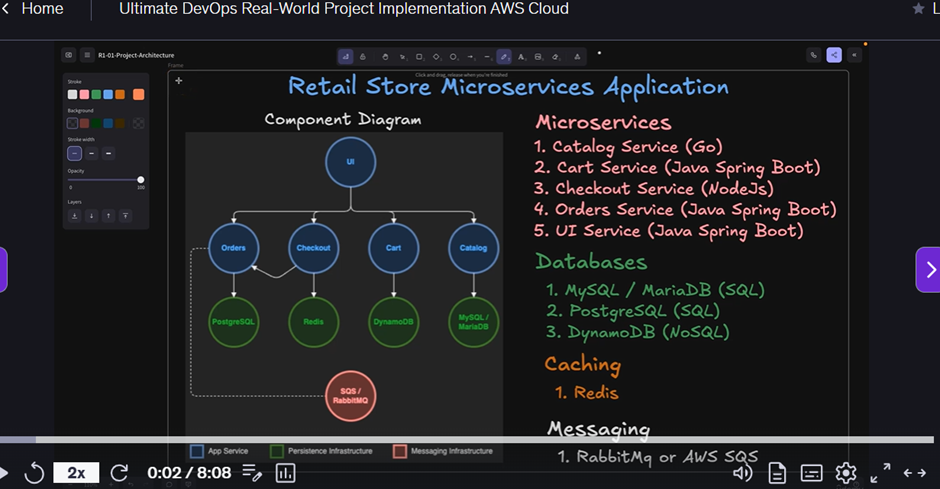

Section 2 : Docker Command
Docker Concepts Covered  :
 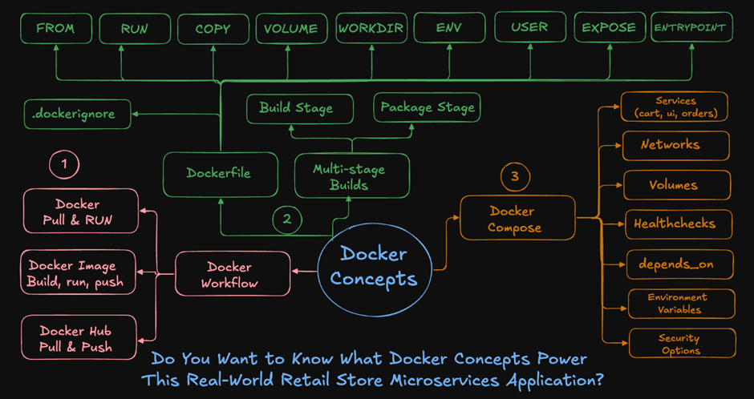

Create EC2 Instance and Install Docker:
1. Launch EC2 Instance
Use the AWS Console to launch a new EC2 instance .
2. Connect via SSH
ssh -i your-key.pem ec2-user@<your-ec2-public-ip>
 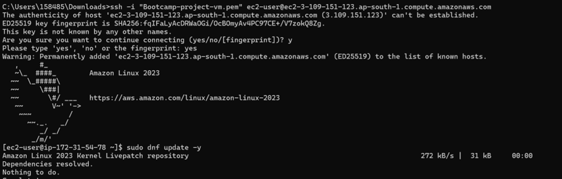
________________________________________
3. Install Docker on Amazon Linux 2023
sudo dnf update -y
sudo dnf install docker -y
sudo systemctl enable docker
sudo systemctl start docker
sudo usermod -aG docker ec2-user

 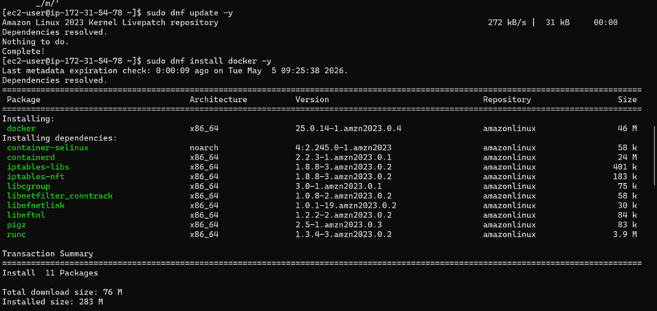

 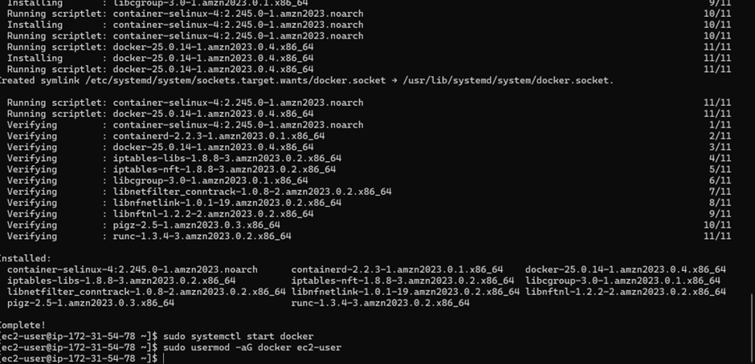

# Check Docker version
docker version
 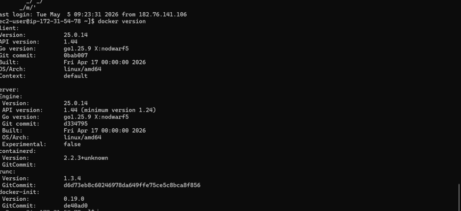

# List Docker images (should be empty initially)
docker images
# Run a test container
docker run hello-world
# List images again (should now include hello-world)
docker images
 
 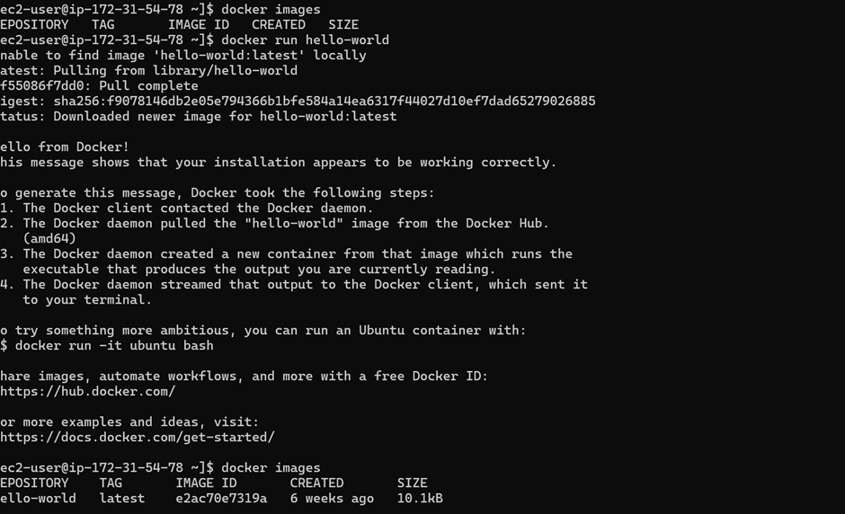

docker ps : Docker all currently running containers
docker ps -a : list all contanier Which is running and stopped
docker ps  -aq  : it will give container id 
docker rm  $( docker ps  -aq  ) : it will removed stopped container
docker rmi :  Delated images 
docker  images  -q : gives image id 

 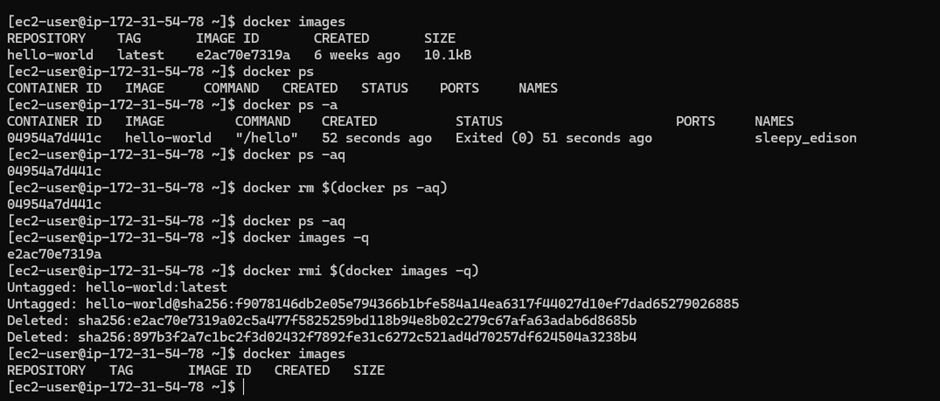

 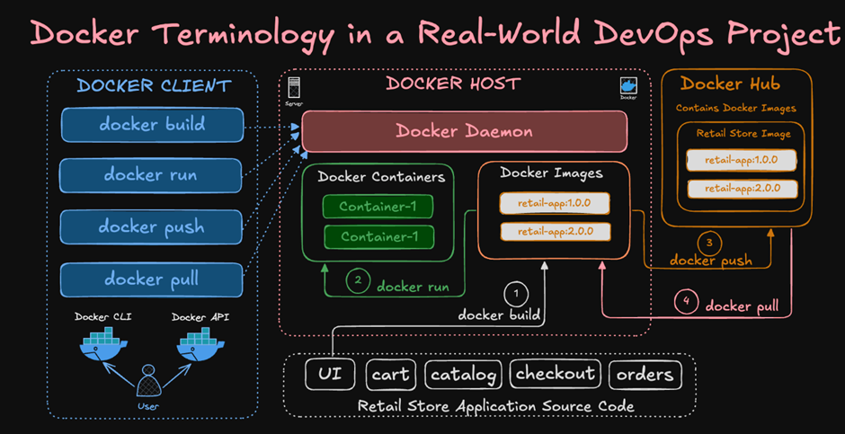

Pull and Run Docker Images from Docker Hub and Run
 

# Pull Docker image from Docker Hub
docker pull stacksimplify/retail-store-sample-ui:1.0.0
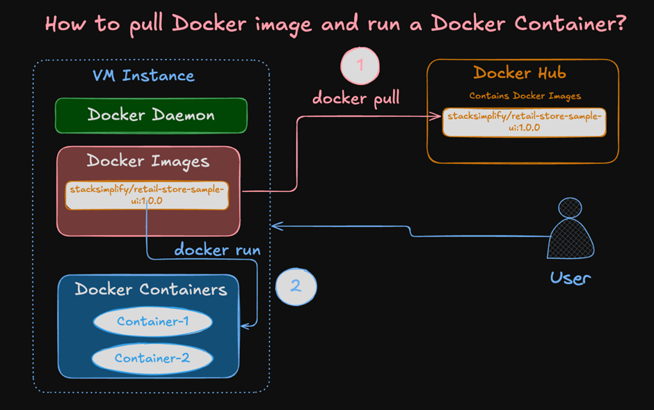
# Alternatively, pull from GitHub Packages (no download limits)
docker pull ghcr.io/stacksimplify/retail-store-sample-ui:1.0.0
# List Docker images to confirm the image is pulled
docker images
 
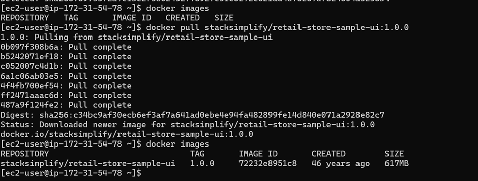

Run the Downloaded Docker Image
•	HOST_PORT: The port number on your host machine where you want to receive traffic (e.g., 8888).
•	CONTAINER_PORT: The port number within the container that's listening for connections (e.g., 8080).
# Run Docker Container
docker run --name <CONTAINER-NAME> -p <HOST_PORT>:<CONTAINER_PORT> -d <IMAGE_NAME>:<TAG>
 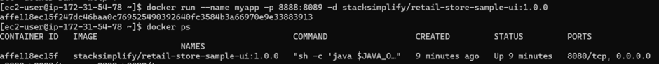
 
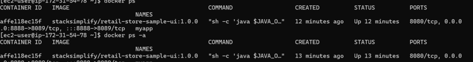

Connect to Docker Container Terminal
docker exec -it <CONTAINER-NAME> /bin/sh
# Inside the container, you can run the following commands:
## Basic OS Info
uname -a                    # Kernel version and system details
cat /etc/os-release         # Check base OS details
whoami                      # See current user (usually 'root')
## File System + App Structure
pwd                         # Current directory (usually /)
ls                          # List files
ls -l /app                  # Check where app.jar is located (if /app is used)
## Java Runtime
java -version               # Verify Java is installed and check version
## Test Application (from inside container - Container port 8080)
curl http://localhost:8080  # Send a request to the app running inside
## Exit container shell
exit 
 
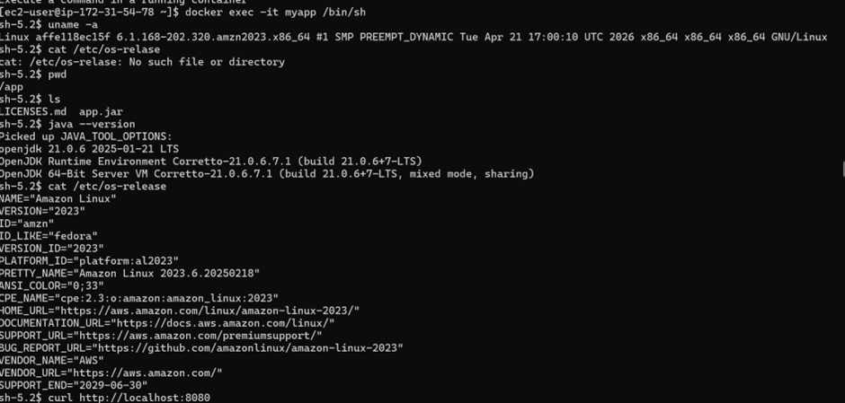

 Stop and Start Docker Containers
stop a running container
docker stop <CONTAINER-NAME>
# Start the stopped container
docker start <CONTAINER-NAME>

 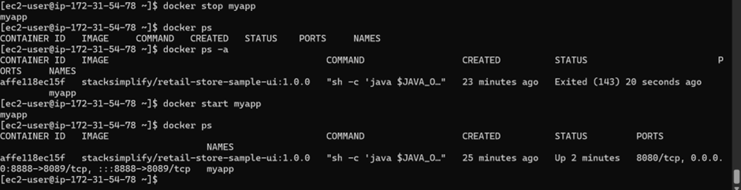

remove the container
docker rm <CONTAINER-NAME>
#  stop and remove the container in one command
docker rm -f <CONTAINER-NAME>
docker rm -f myapp1

 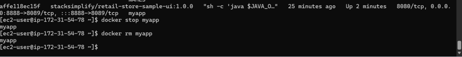

 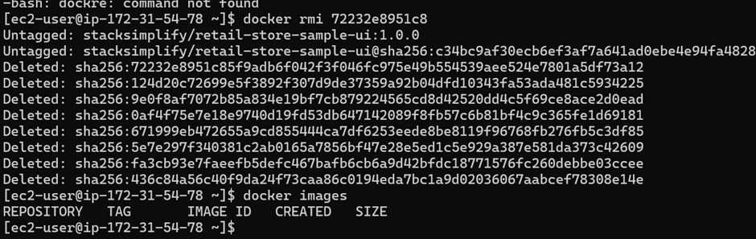

How to Create and Push Docker Images to Docker Hub : 
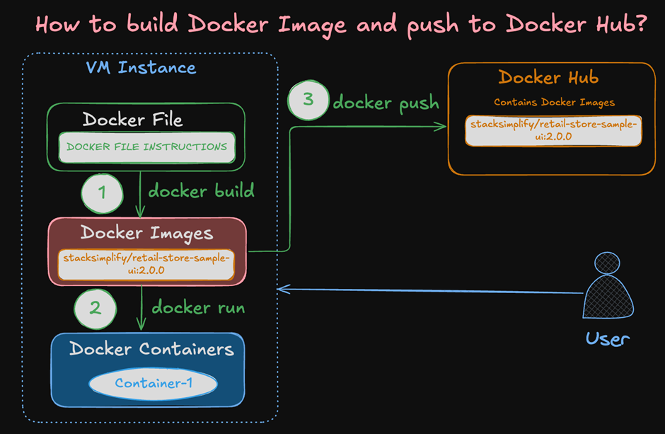
 

Verify Docker Version and Log In via Command Line
# Check Docker version
docker version
# Log in to Docker Hub
docker login
# To Logout from Docker Hub (Optional)
docker logout

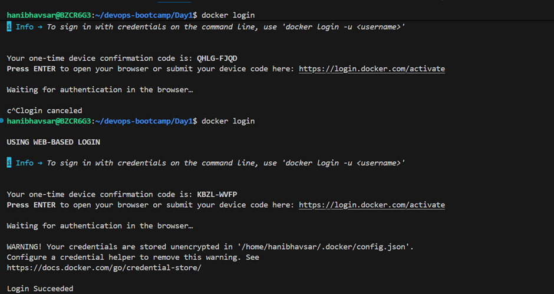

 Docker Image  built:
# Create a Folder
mkdir demo-docker-build
cd demo-docker-build
# Download the Application Source
wget https://github.com/aws-containers/retail-store-sample-app/archive/refs/tags/v1.2.4.zip
# Unzip Application Source
unzip v1.2.4.zip
# Make change to file
cd /home/ec2-user/demo-docker-build/retail-store-sample-app-1.2.4/src/ui/src/main/resources/templates
File name: home.html
We are making a change for UI stating V2 at line 
# List to Verify if we are at that file
ls home.html
ls -lrt

# Changes we are doing 
## Before
          The most public Secret Shop
## After
          The most public Secret Shop - V2 Version          
# Command to Make That Change via Terminal (No Manual Editing)
sed -i 's/Secret Shop<\/span>/Secret Shop - V2 Version<\/span>/' home.html
# Verify It Worked:
grep 'Secret Shop' home.html
 
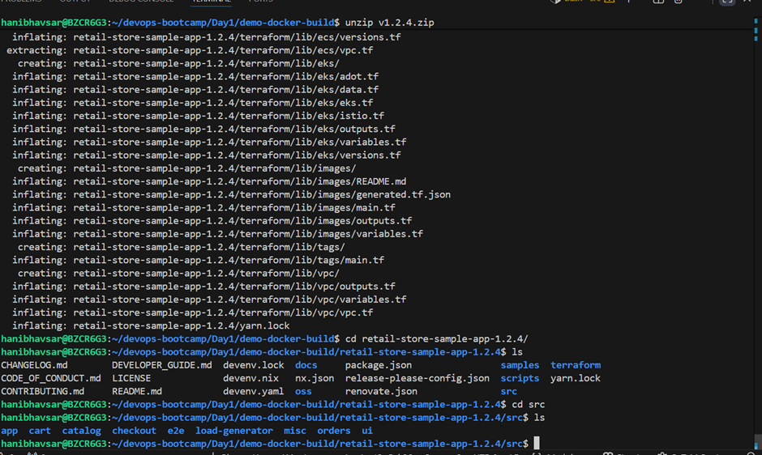
 
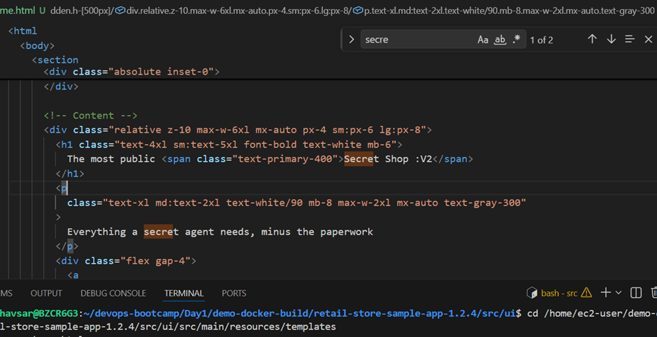

Build Docker Image and Run It
# Change to the directory containing your Dockerfile
cd /home/ec2-user/demo-docker-build/retail-store-sample-app-1.2.4/src/ui
# Verify Dockerfile before starting the build
ls -lrt Dockerfile
# Build the Docker image
docker build -t <IMAGE_NAME>:<TAG> .
# List Docker images
docker images
# Run the Docker container and verify
docker run --name <CONTAINER-NAME> -p <HOST_PORT>:<CONTAINER_PORT> -d <IMAGE_NAME>:<TAG>
# Access the application in your browser
http://<EC2-Instance-Public-IP>:8889
## RUN Container: 1.0.0 version on Host port 8888 (TO COMPARE WITH 2.0.0)
# Example using Docker Hub image:
docker run --name myapp1 -p 8888:8080 -d stacksimplify/retail-store-sample-ui:1.0.0

# Or using GitHub Packages image:
docker run --name myapp1 -p 8888:80 -d ghcr.io/stacksimplify/retail-store-sample-ui:1.0.0
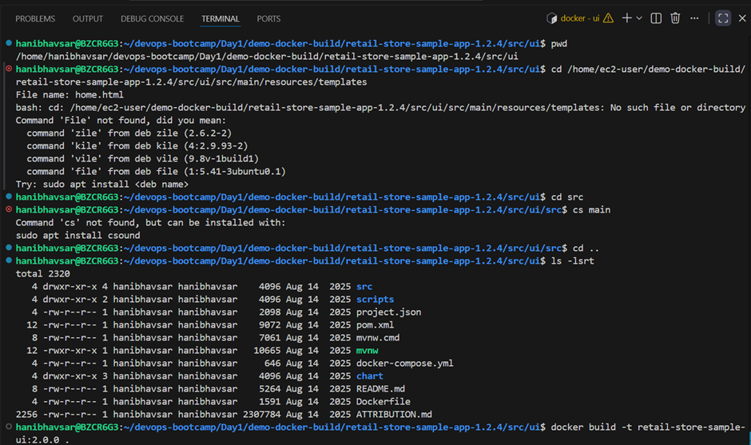

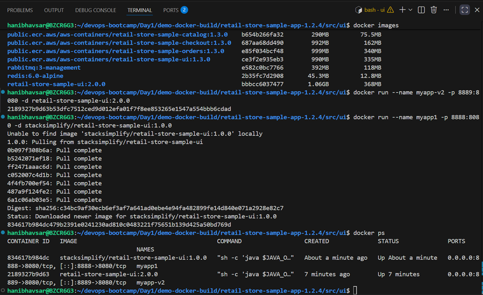

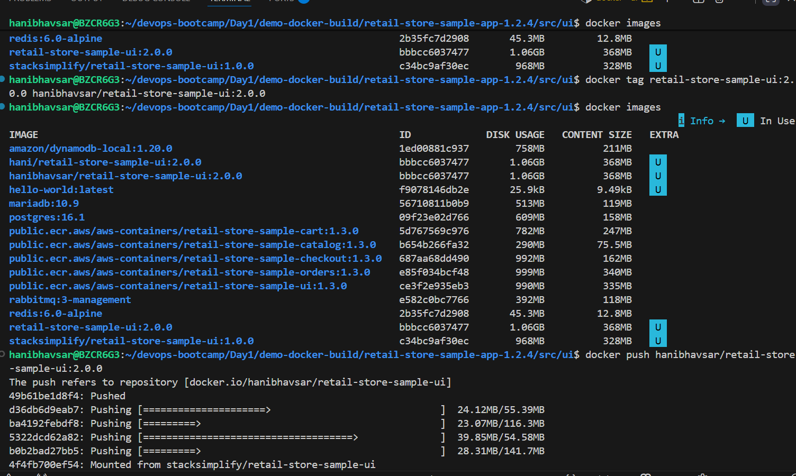

# Dockerfile
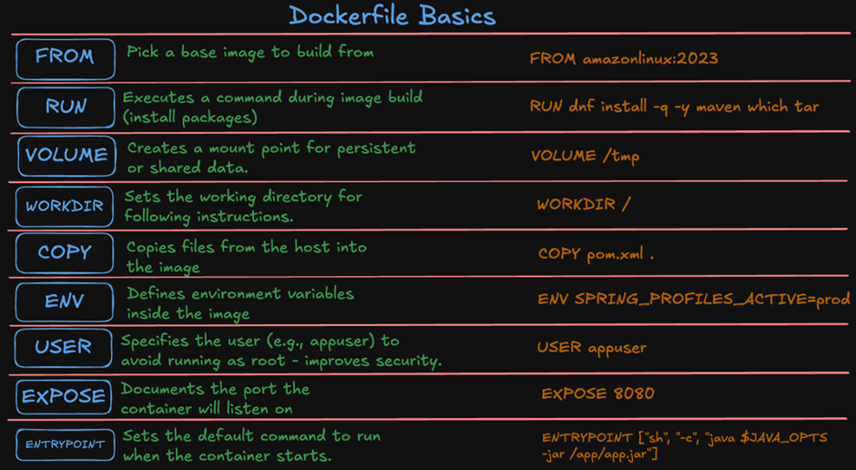

# Multistage Docker Build
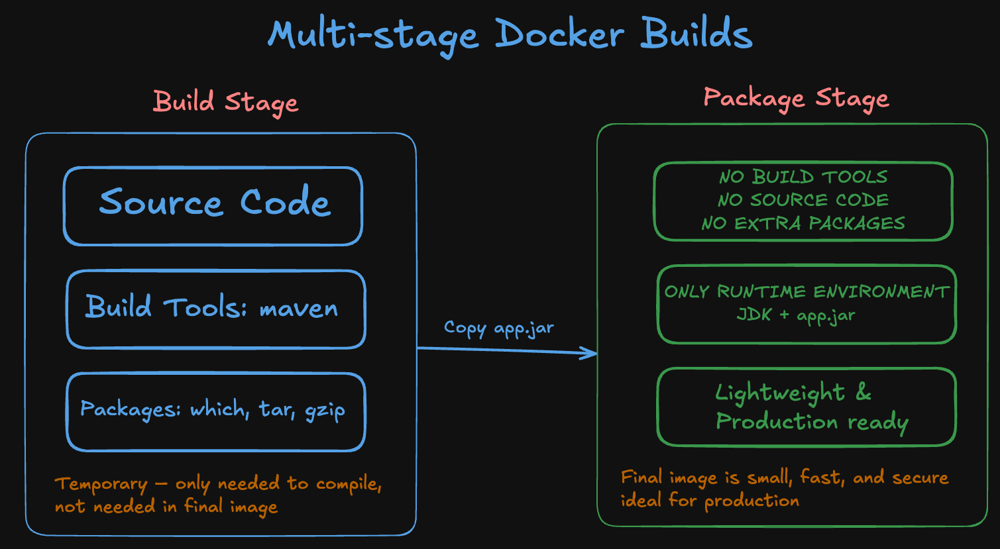

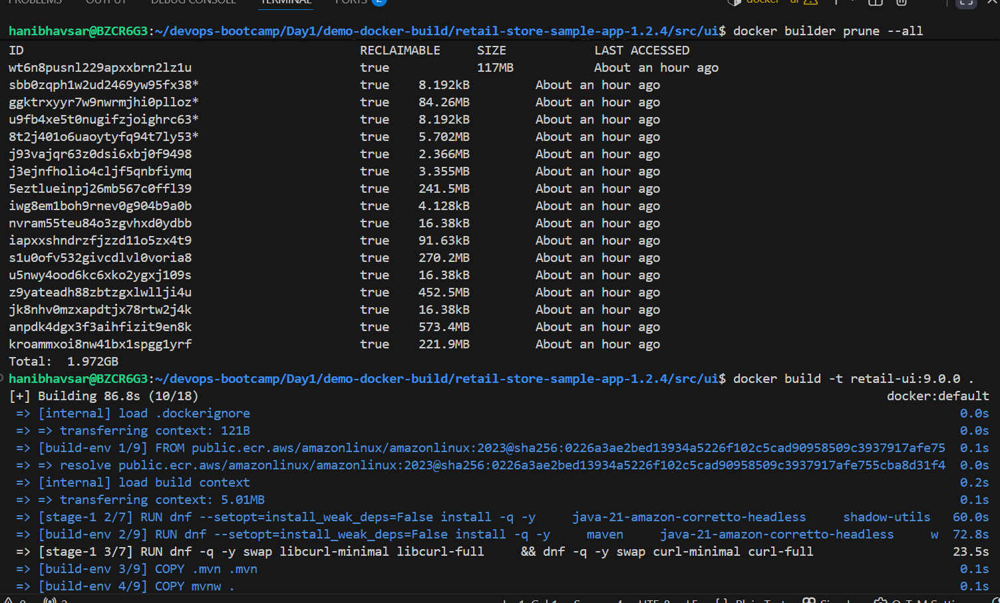

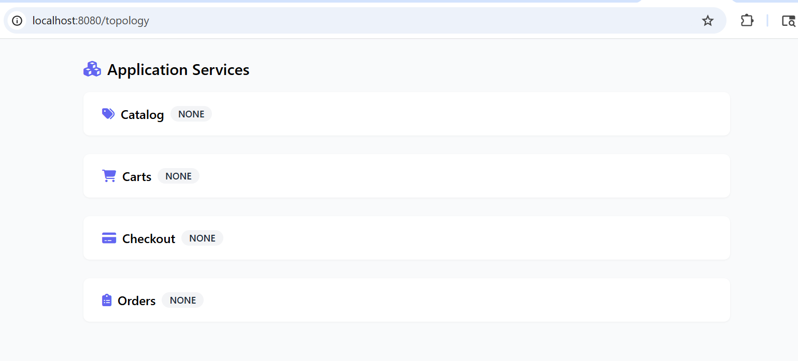

# CleanUp 
docker stop retail-ui
docker rm retail-ui
docker rmi retail-ui:9.0.0

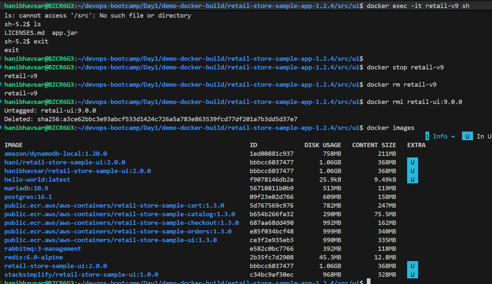

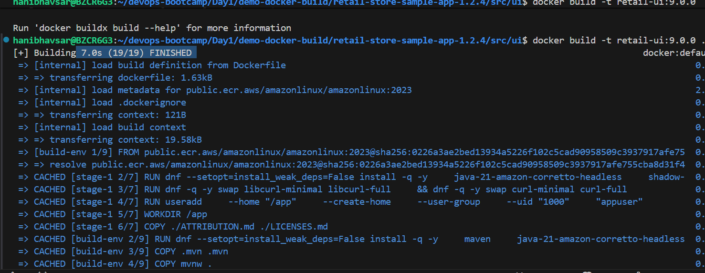

 If you want to rebuild from scratch and ignore cache:
docker build --no-cache -t retail-ui:10.0.0 .

docker builder prune : Remove  cache 
docker builder prune –all : Remove all Caches
# clean Everything Unused (Stopped containers, volumes, networks, cache, images)**
docker system prune

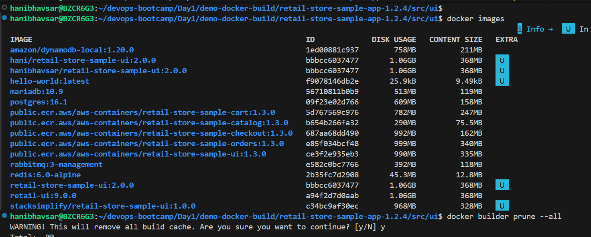

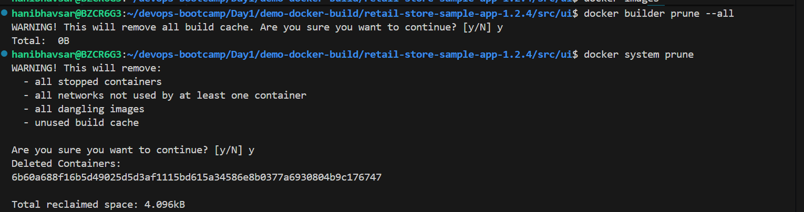

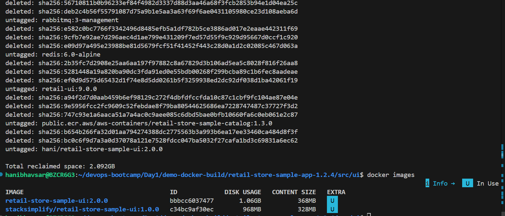

 
