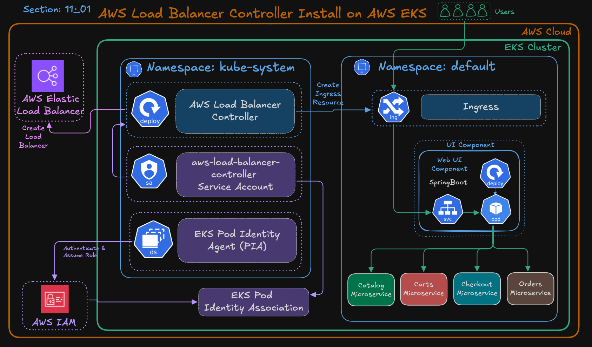
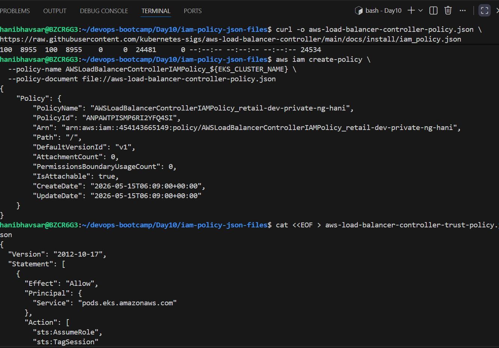
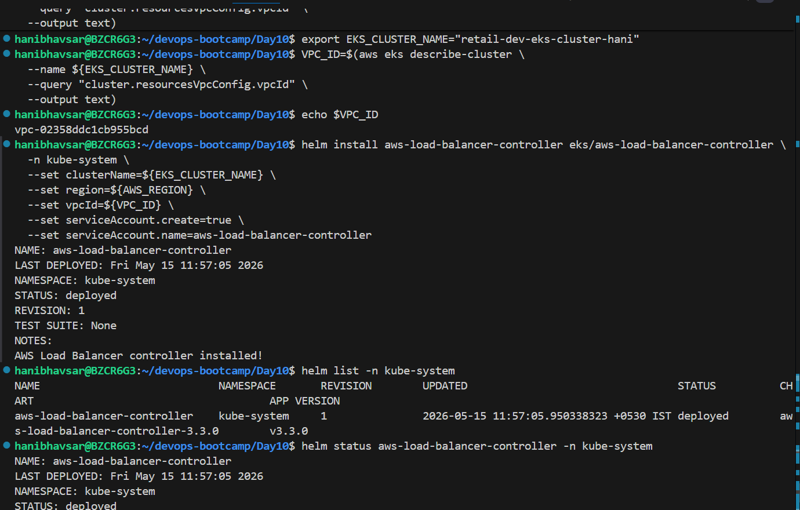
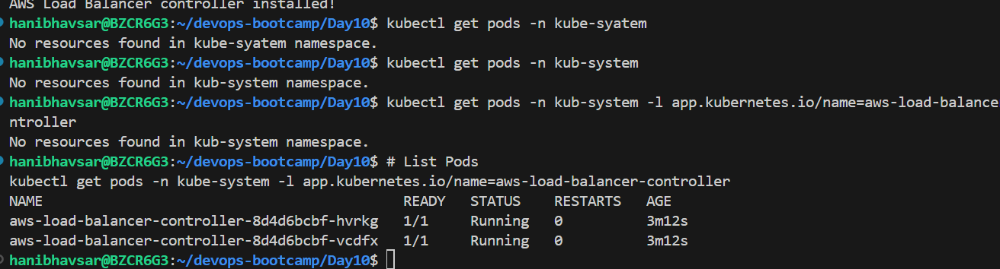
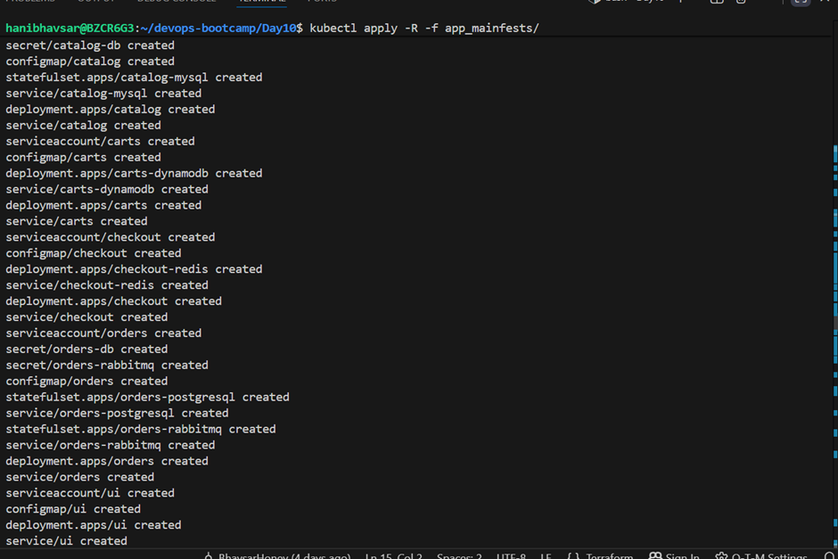
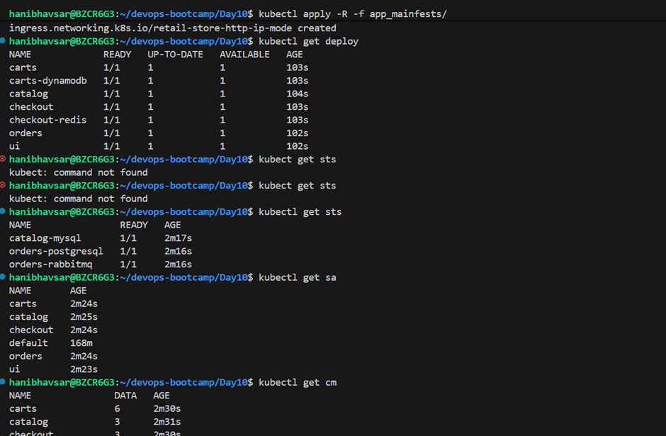
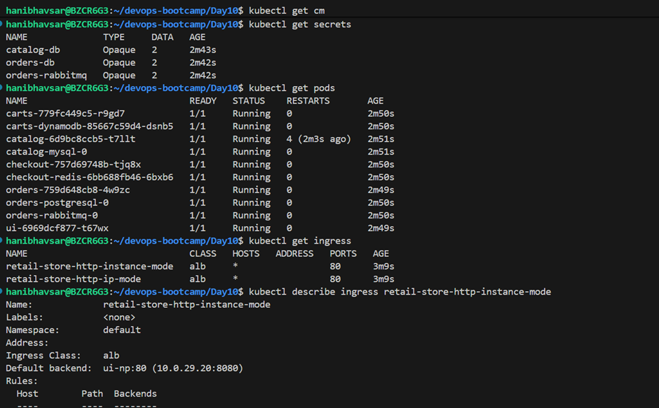
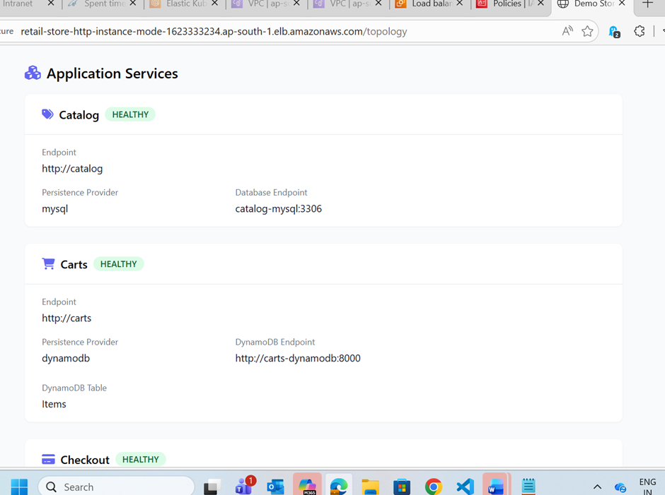

# Kubernetes Ingress :
Ingress exposes HTTP and HTTPS routes from outside the cluster to services within the cluster. Traffic routing is controlled by rules defined on the Ingress resource.

## Types :
1.Path based 
2.Hostname based 
3.Header based 

 # Aws Load balncer controller :
The AWS Load Balancer Controller manages AWS Elastic Load Balancers for a Kubernetes cluster. You can use the controller to expose your cluster apps to the internet. The controller provisions AWS load balancers that point to cluster Service or Ingress resources.

 

 1. Create a trust policy file for the Load Balancer Controller IAM Role.
Create and attach the AWSLoadBalancerControllerIAMPolicy to that role.
Officaitl Iam Policy 

curl -o aws-load-balancer-controller-policy.json \
https://raw.githubusercontent.com/kubernetes-sigs/aws-load-balancer-controller/main/docs/install/iam_policy.json

 

 2. Create an EKS Pod Identity Association between the IAM Role and ServiceAccount.

 3. Install the AWS Load Balancer Controller using Helm.

4. Verify successful deployment.

# Nodeport
In Kubernetes, a NodePort is a service type used to expose an application to external traffic by opening a specific port on every node (server) in your cluster.

## How Ingress Works?
 
Intsnace mode : 
user ->alb ->nodeport->pod

Ip mode :
user->Alb->->Pod

# Kubernetes Ingress - HTTP

1. Deploy ingress HTTP 

2. Verify Ingress HTTP 

3. Check using DNS address 

# Kubernetes Ingress - HTTPS 
For HTTPS setup with a public certificate and DNS, we request a public SSL certificate from AWS Certificate Manager (ACM). After the certificate is issued, we configure DNS records in Route 53. Finally, we update the Ingress manifest file as shown below:

## SSL Settings
 alb.ingress.kubernetes.io/certificate-arn: arn:aws:acm:us-east-1:180789647333:certificate/af739d1d-c527-4a44-a753-464f775dca25

