# Helm
Helm is the package manager for Kubernetes. It simplifies deploying and managing applications by bundling complex Kubernetes YAML configuration files into reusable, versioned packages called Charts

## Helm chart
A Helm Chart is a template/package that contains all Kubernetes YAML files and configuration needed to deploy an application.

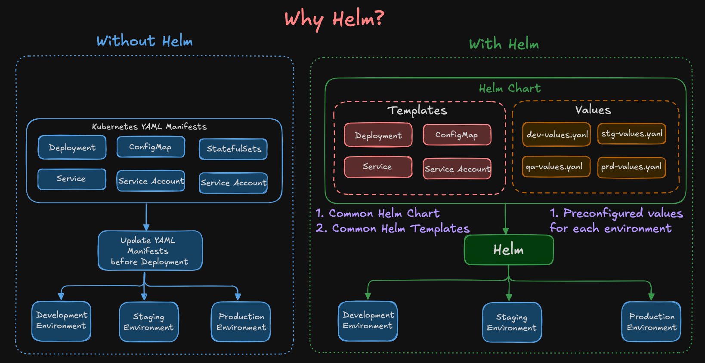

# Helm WorkFlow

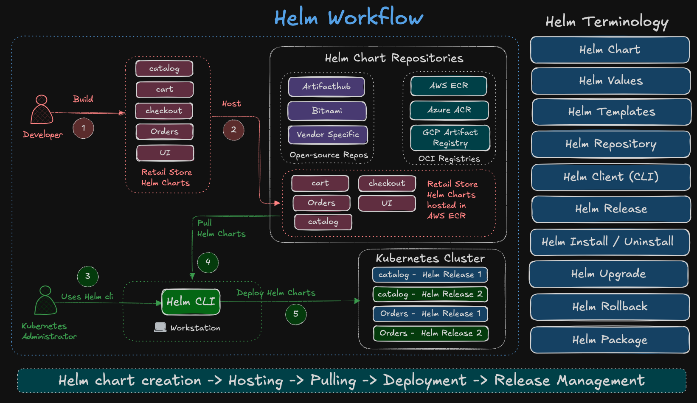

# Helm image Installtion 

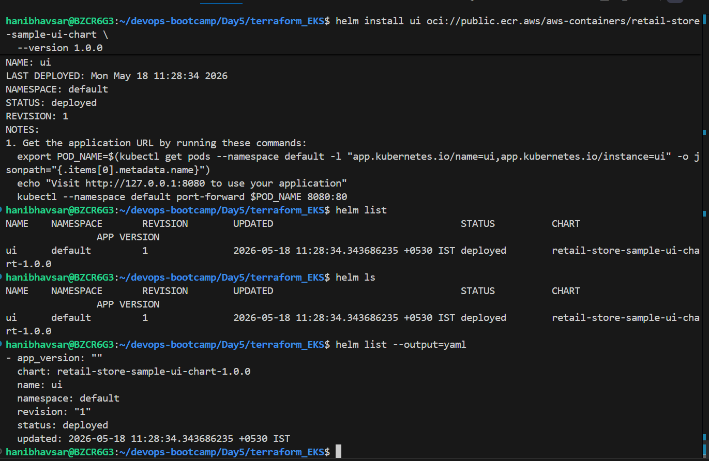

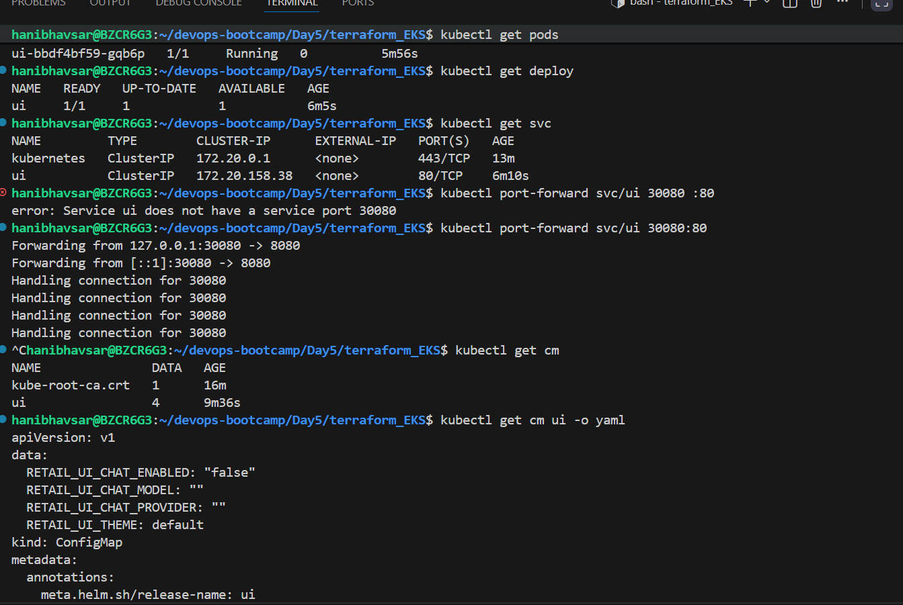

## Helm  imgae upgred 

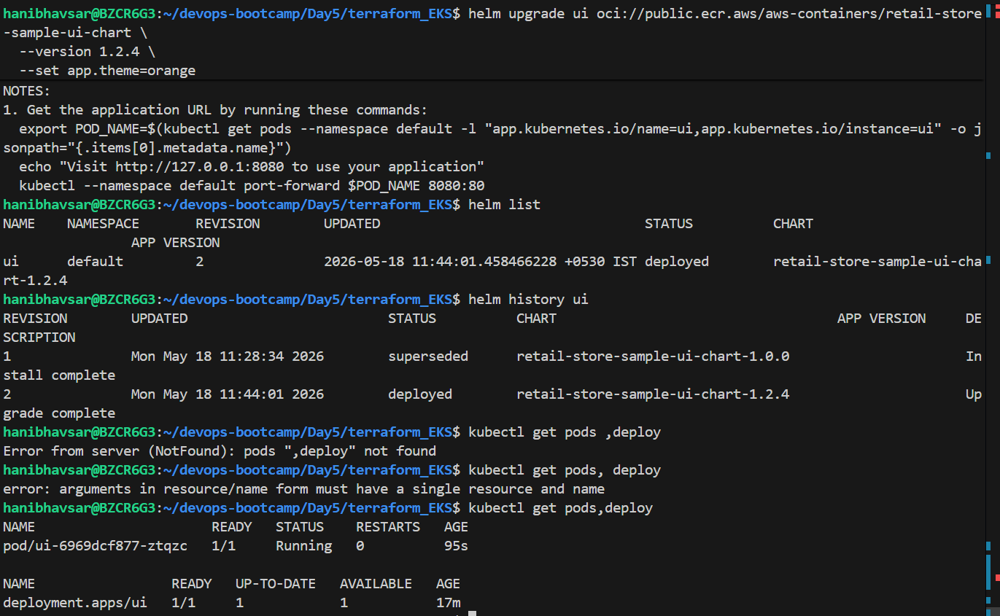

## Helm get Values 

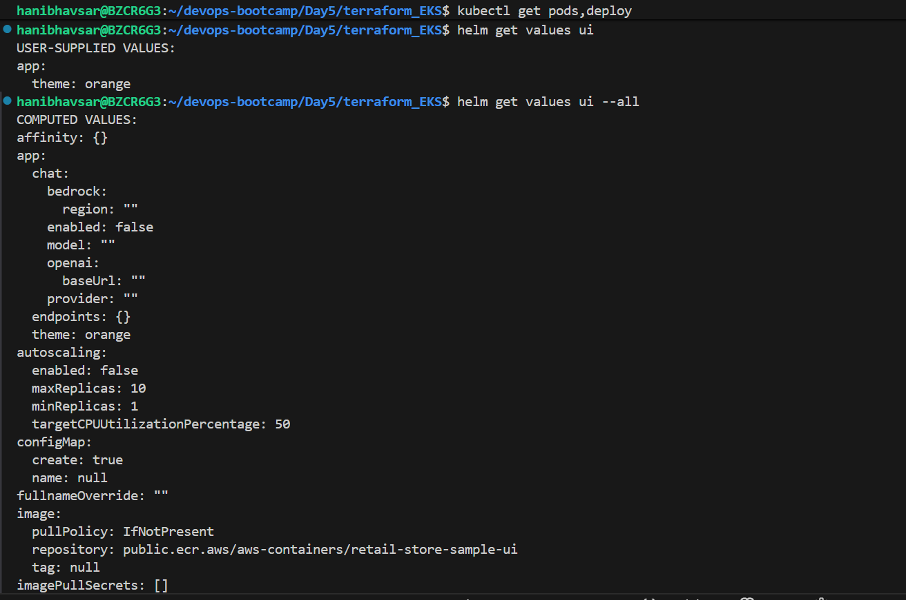

## Helm Rollback 

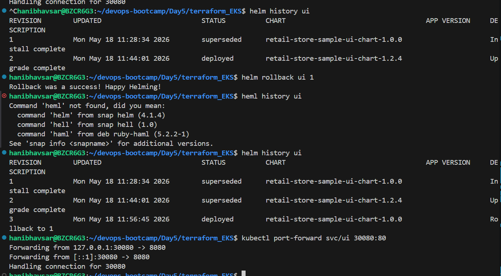

## update Application Theam
 Pods may not restart automatically because ConfigMap/env changes don’t always trigger a rollout. If that happens, restart the Deployment manuall

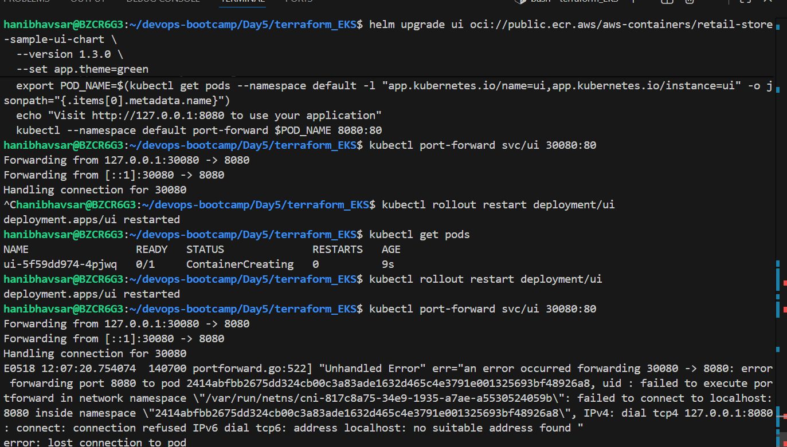

## Helm Values 
we can set Values using 
1) values .yaml file 
2) Overrides 
   - -f values-ui.yaml 
   - -set 
Preecedence : --set > -f > Value.yaml file

## To show Values 

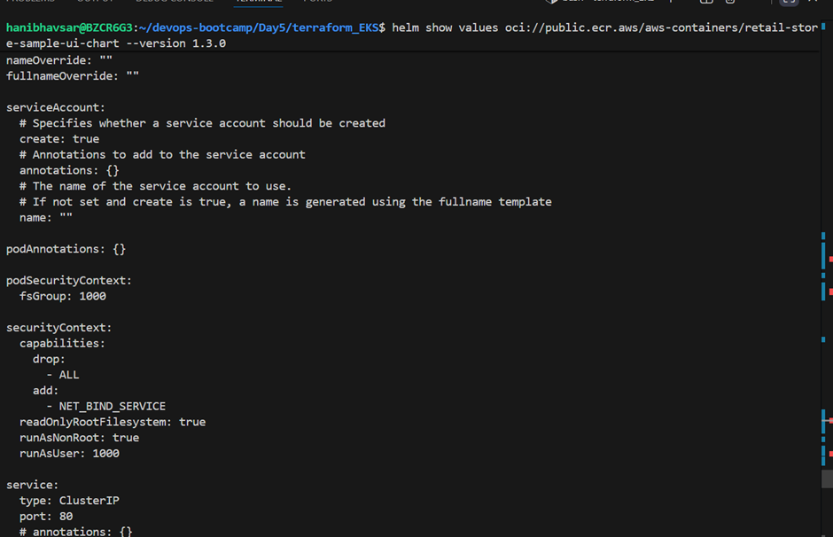

## Dry run and apply values 

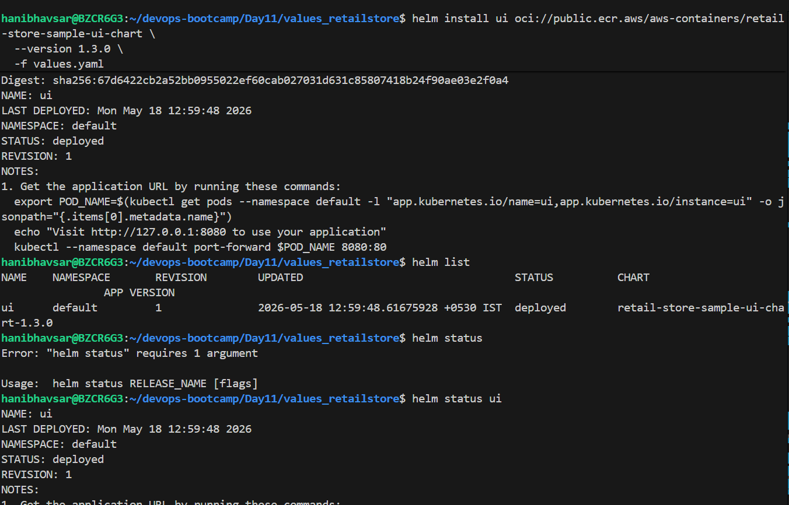

## To Show reosuces 

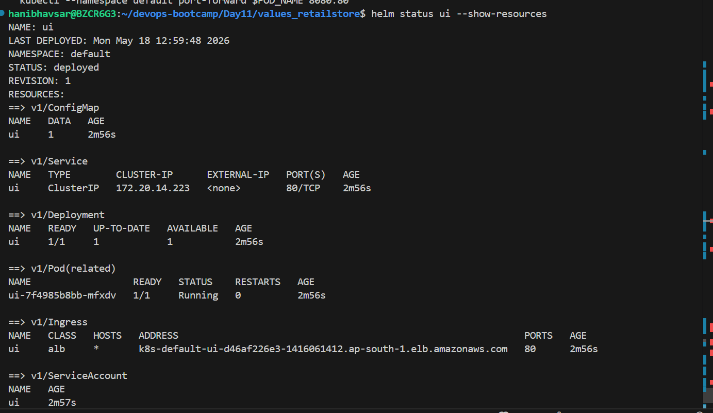

## Helm chart : what each file Do

* **`Chart.yaml`** – Chart metadata: `name`, `description`, `type`, `version` (chart), `appVersion` (app).
* **`values.yaml`** – Default values shipped with the chart (what gets used when you don’t override).
* **`.helmignore`** – Files/paths excluded when packaging.
* **`templates/`** – Where the K8s YAML templates live:

  * `deployment.yaml` – Pod/ReplicaSet spec; references many `.Values.*` keys.
  * `service.yaml` – ClusterIP/LoadBalancer spec and ports.
  * `ingress.yaml` – Ingress rules and annotations (if supported).
  * `configmap.yml` (or similarly named) – App configuration rendered from values.
  * `_helpers.tpl` – Helper templates for names/labels (used across templates).
  * `NOTES.txt` – Post-install notes printed by Helm.
  * Optional: `hpa.yaml`, `serviceaccount.yaml`, `tests/*` (Helm test hooks), `istio-*.yml`.

## Helm lint and render 
it will check and validate helm chart 

## helm templete 
  it will rendere into chart into locally

helm template ui ./ui -f ../retailstore-apps/values-ui.yaml | less

 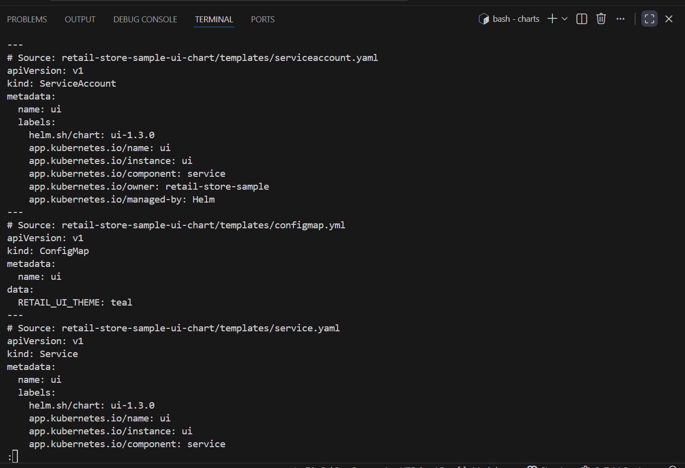

 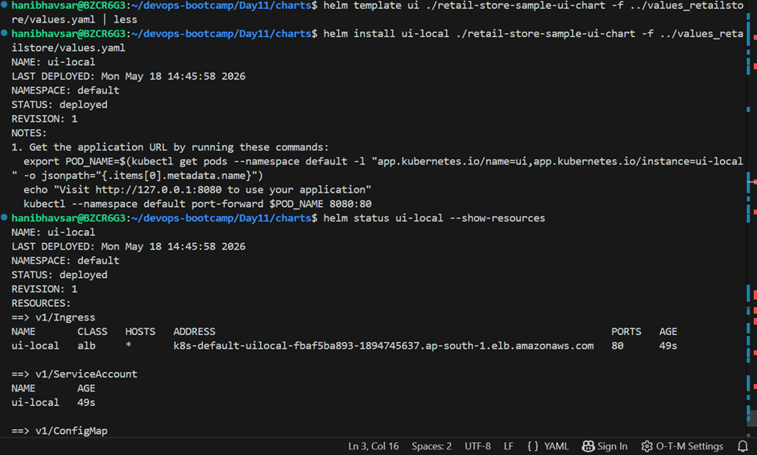

 # quick values changes 

helm template ui ./ui -f ../retailstore-apps/values-ui.yaml | less
## See where theme appears
helm template ui ./ui -f ../retailstore-apps/values-ui.yaml | grep -ni theme

## helm Test 
helm test ui-local

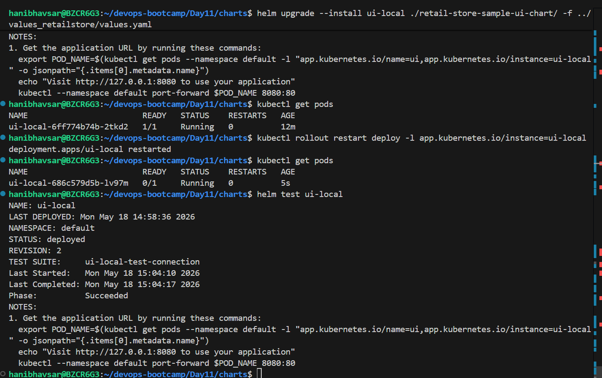

# create ECR repo and push images 

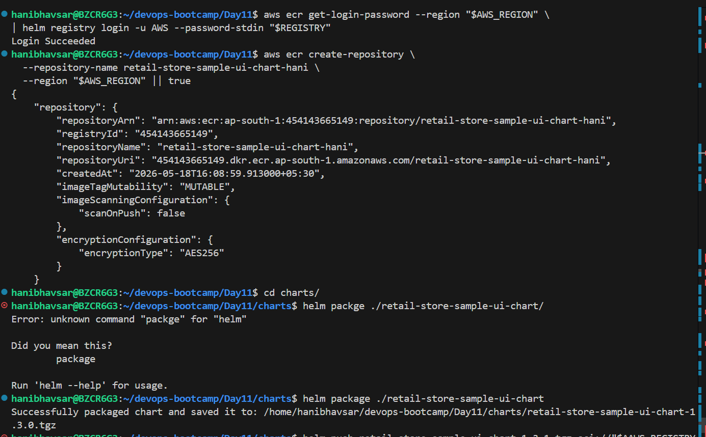

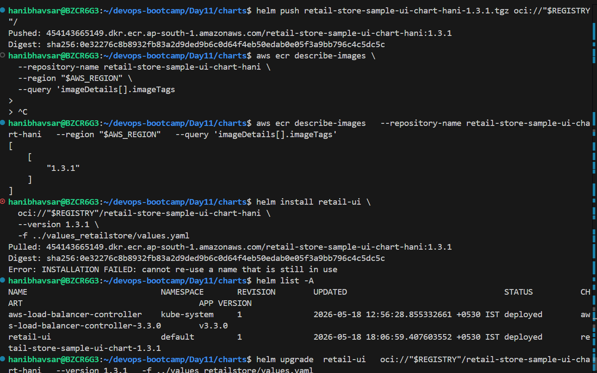

# Install Chart from ECR Private

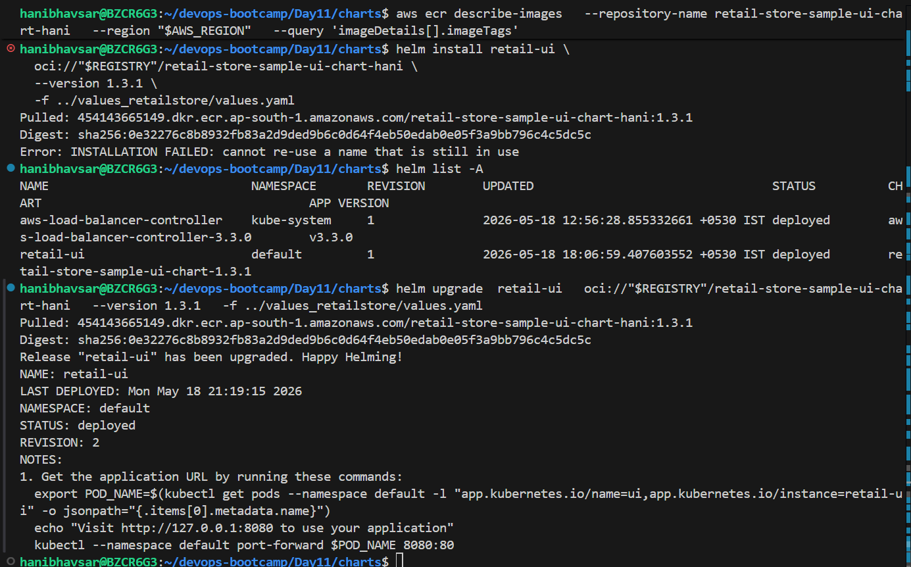
