# What is Docker Compose ?
Docker Compose is a tool for:
Defining multi-container apps in a single YAML file
Managing networks, volumes, dependencies
Running all services with docker compose up
Testing, tearing down, and rebuilding environments easily

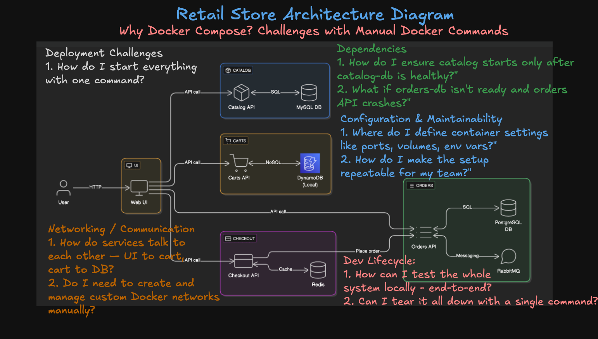

# install Docker Compose

``bash
# Create the CLI plugin directory
sudo mkdir -p /usr/local/lib/docker/cli-plugins

# Download the latest Docker Compose v2 binary (always pulls the newest release)
wget https://github.com/docker/compose/releases/latest/download/docker-compose-linux-x86_64 -O docker-compose

# Make it executable
chmod +x docker-compose

# Move it to the CLI plugins directory
sudo mv docker-compose /usr/local/lib/docker/cli-plugins/docker-compose

# Verify install
docker compose version
````
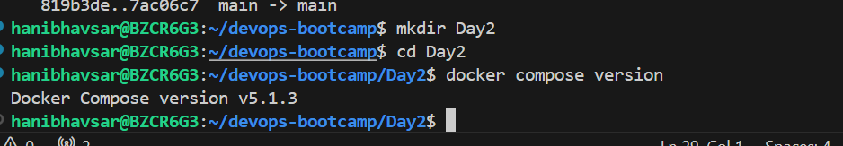

```bash
# Create Directory
mkdir demo-compose
cd demo-compose

# Download the Docker Compose file
wget https://github.com/aws-containers/retail-store-sample-app/releases/download/v1.3.0/docker-compose.yaml

# Set environment variable
export DB_PASSWORD='mydbkalyan101'

## Important Note:  if your file name is docker-compose.yaml dont need to specify -f with file
docker compose -f docker-compose.yaml up
docker compose up

````
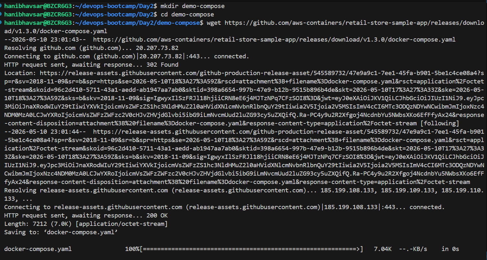

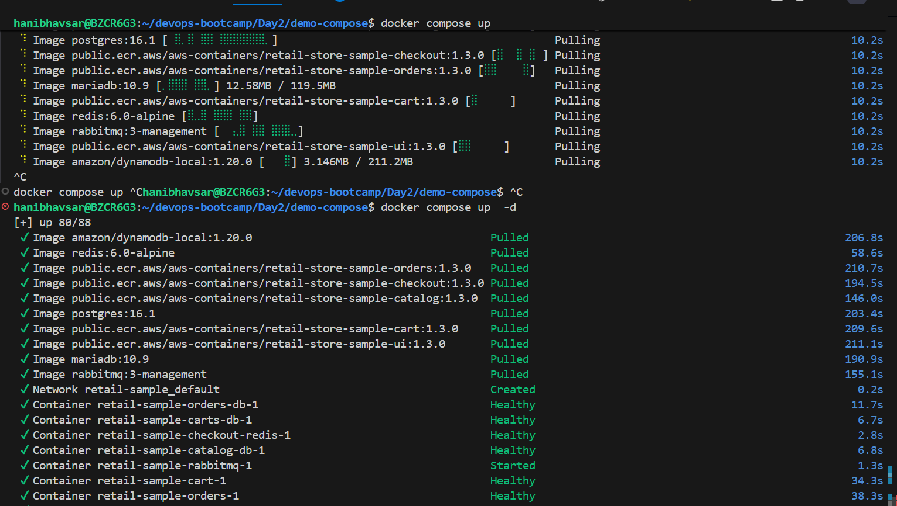

### List Running Services

```bash
# List Services 
docker compose ps

# Also verify Docker images it downloaed
docker images
```
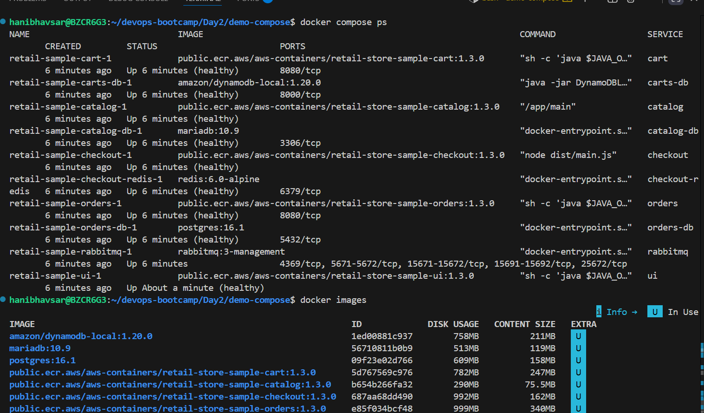

### Stop / Start a Single Service

```bash
# Stop a Service
docker compose stop orders

# Verify if service is stopped
docker compose ps
docker compose ps -a

# Start a Service
docker compose start orders
```
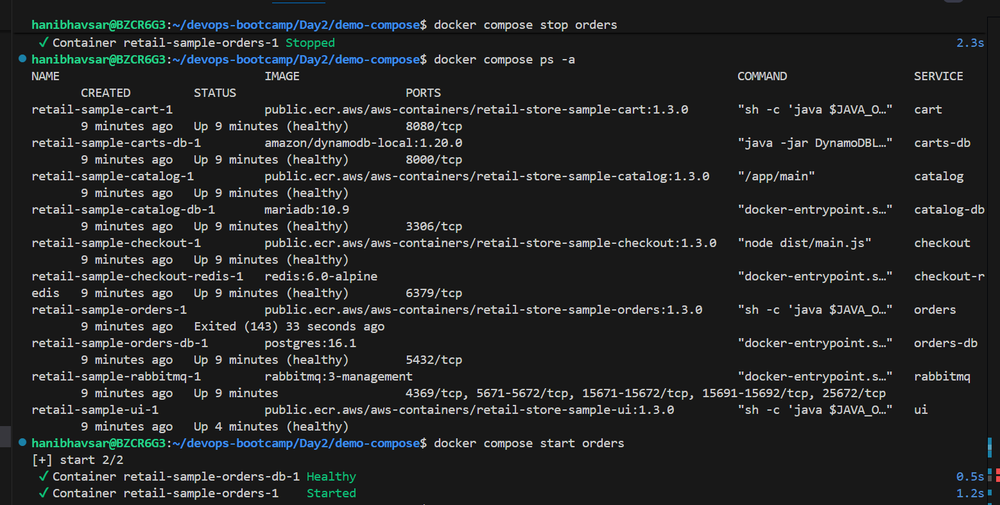

### Restart a Service

```bash
# Restart a Service
docker compose restart cart

# Verify if service restarted
docker compose ps
```
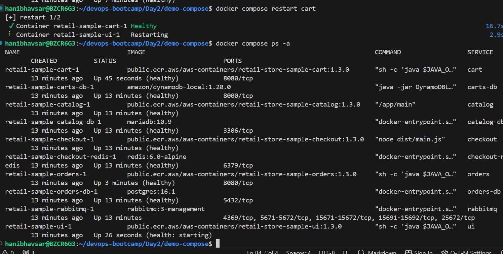

---

## Step-07: View Logs

```bash
# Logs for all services
docker compose logs

# Logs for a specific service
docker compose logs checkout

# Follow logs
docker compose logs -f checkout
```
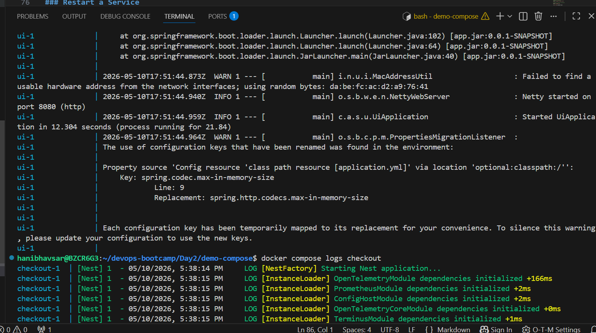


---

## Step-09: Docker Compose Stats
Display a live stream of container(s) resource usage statistics

```bash
# Stats 
docker compose stats

# Specific Containers
docker compose stats ui
```
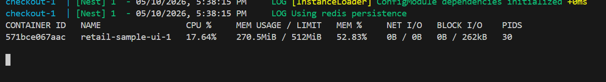

---

## Step-10: Display the running process in a container
```bash
# Display the running process of all service containers
docker compose top

# Specific containers
docker compose top ui
docker compose top checkout
```

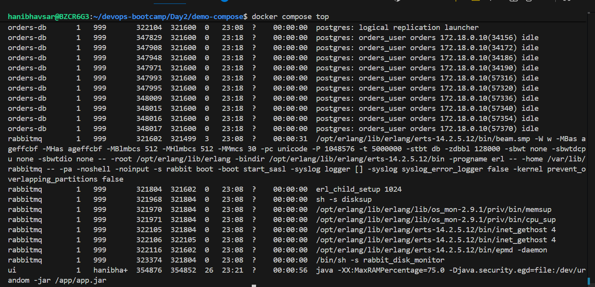

---
# change UI colors
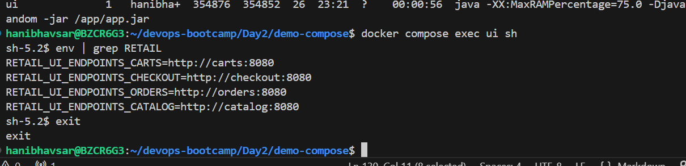

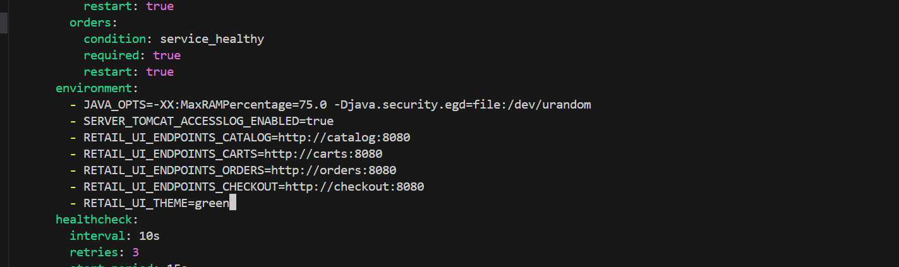

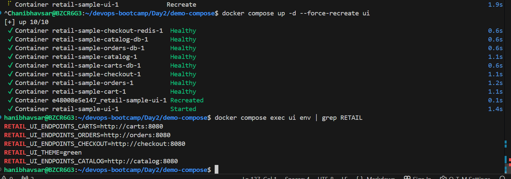


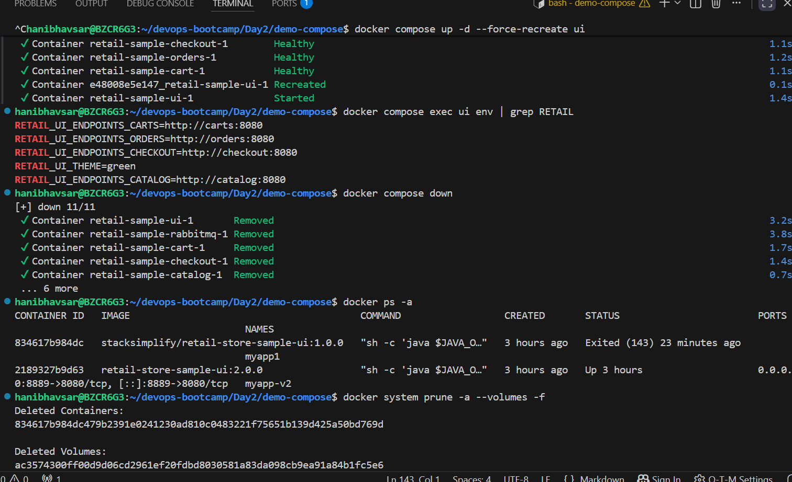

