# Section 06 : Terraform basic  

 # Why Terraform?
Terraform is used to define, provision, and manage infrastructure (servers, databases, networks) as code, allowing developers to automate deployment using human-readable configuration files. It ensures consistent, repeatable, and documented infrastructure across multiple cloud providers (AWS, Azure, GCP), effectively eliminating manual errors and managing infrastructure drift.
 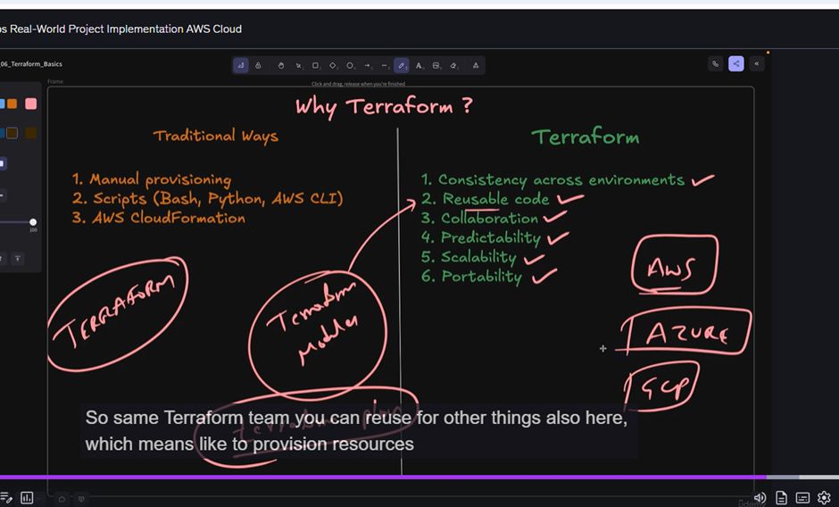

# Desired state: 
Which we have written in terraform code 

# Terraform installation  :
https://developer.hashicorp.com/terraform/tutorials/aws-get-started/install-cli

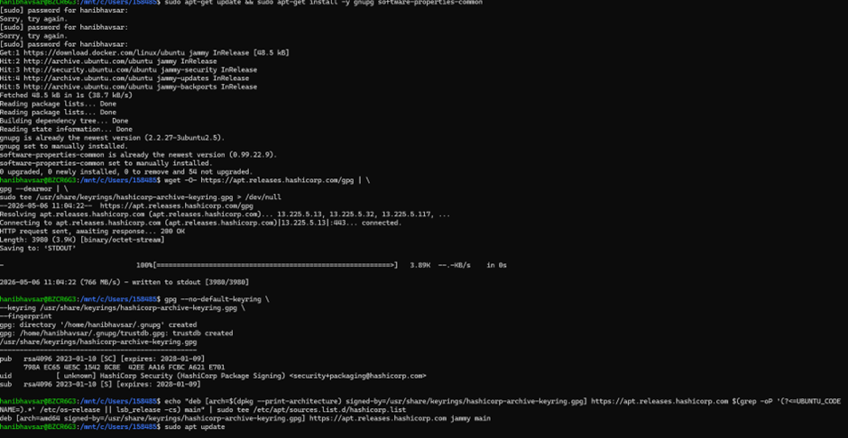
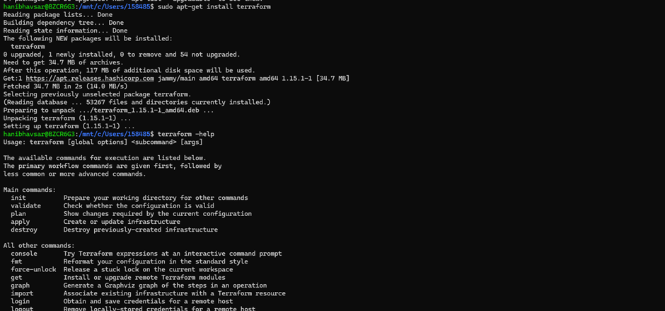
 
# Terraform Execution Flow: 
Terraform providers are plugins that act as intermediaries between Terraform and various cloud platforms, SaaS providers, and APIs, allowing for infrastructure management

Basic Terraform Commands: init, validate, plan, apply, destroy
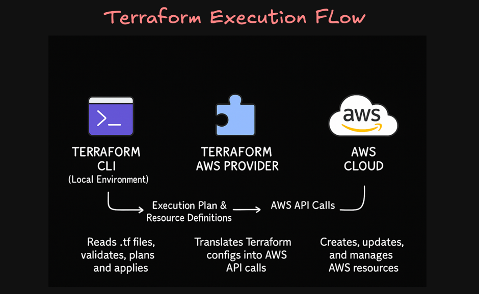

Argument reference : what are configuration  details you  can use
attribute reference :  all metadata for that resource is availbe id for the bucket 

output block : 
after Successful terraform apply you can print value of the resource 

The .terraform.lock.hcl file is a dependency lock file that Terraform uses to ensure that every team member and environment uses the exact same version of provider plugins

Terraform Validate : validate configuration and syntax in locally 
Terraform apply –auto approve  : it will not ask confirmation
Terraform plan  - out=S3paln(file name /file name path )
Terrform  show S3plan (plan file name ) : review binarly plan file
Uses locals block to create dynamic names and reuse logic (like resource naming conventions).

 
 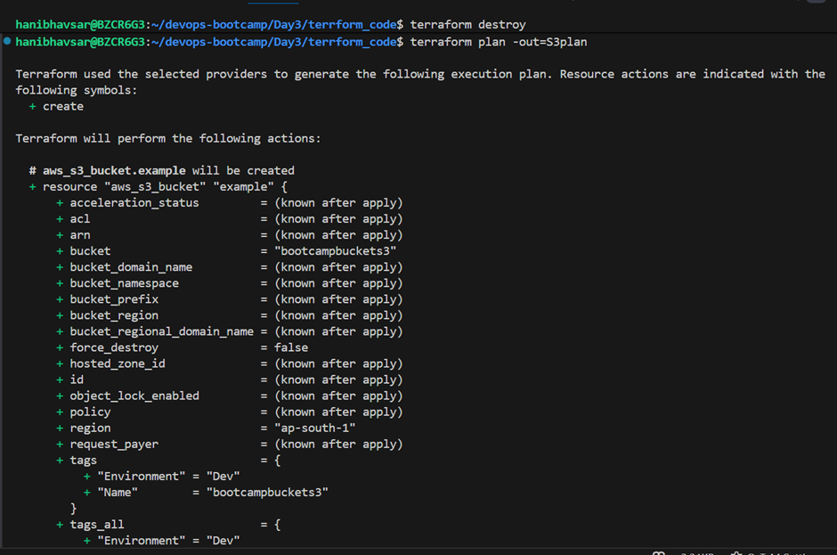
 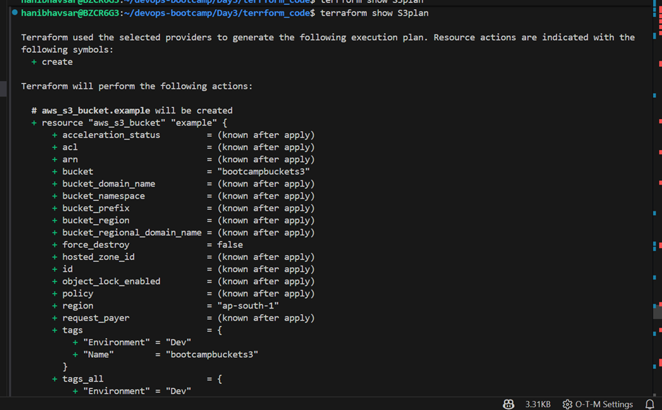
 
 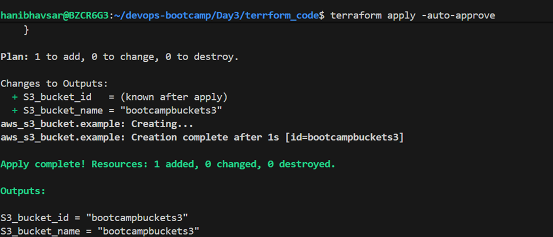

# Meta-arguments:
depends_on : The depends_on meta-argument instructs Terraform to complete all actions on the dependency object, including read operations, before performing actions on the object declaring the dependency.

Created two subnets using an existing VPC, internet gateway (IGW), and NAT Gateway. Also created two route tables associated with the subnets in a single availability zone (AZ)
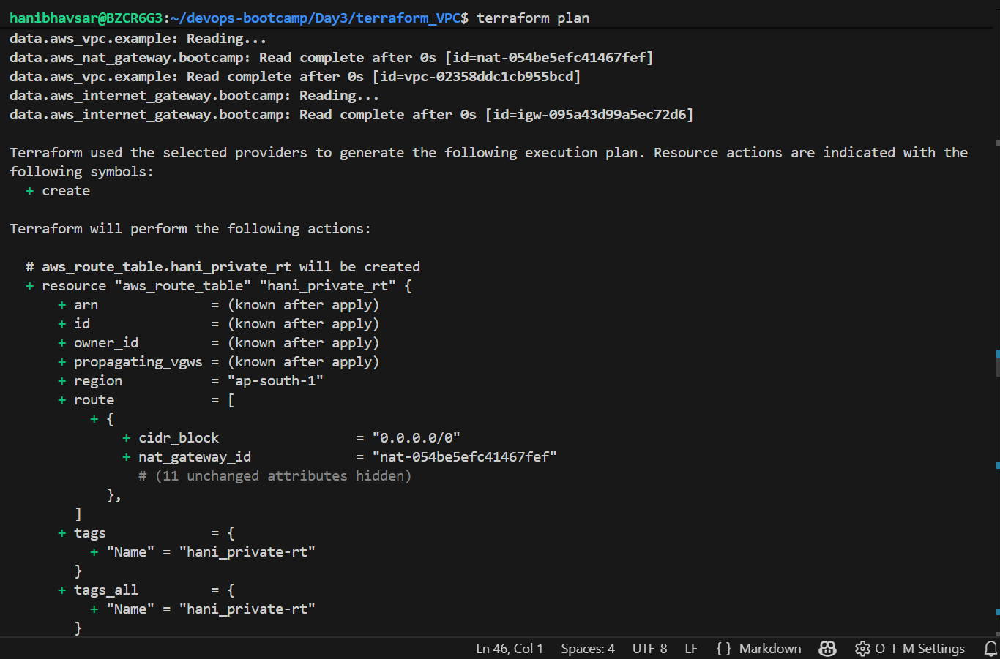
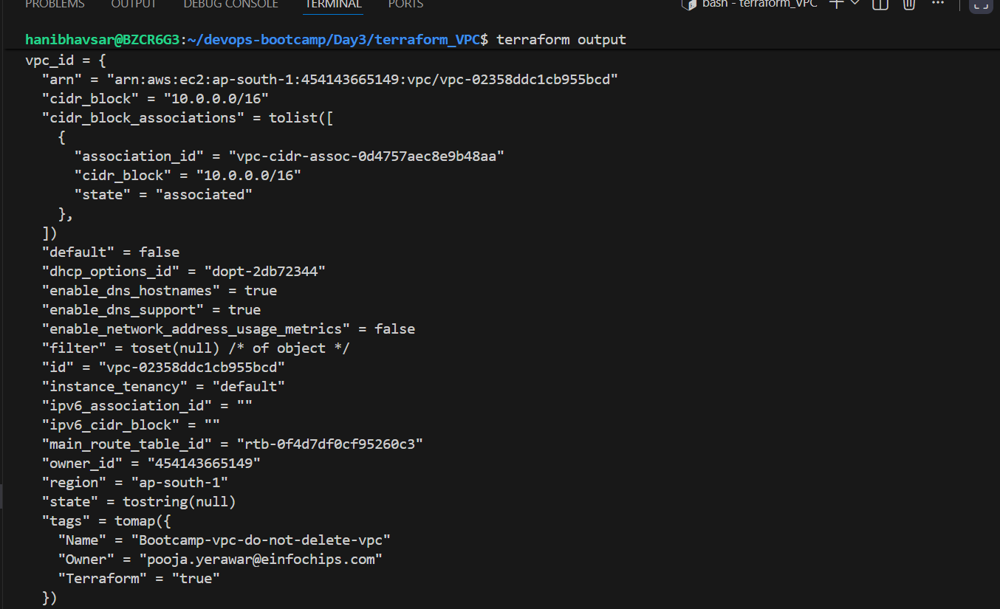
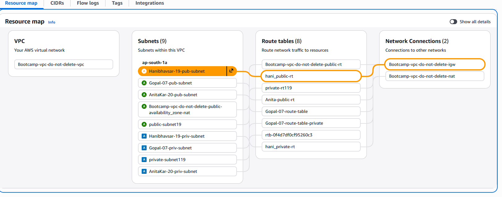
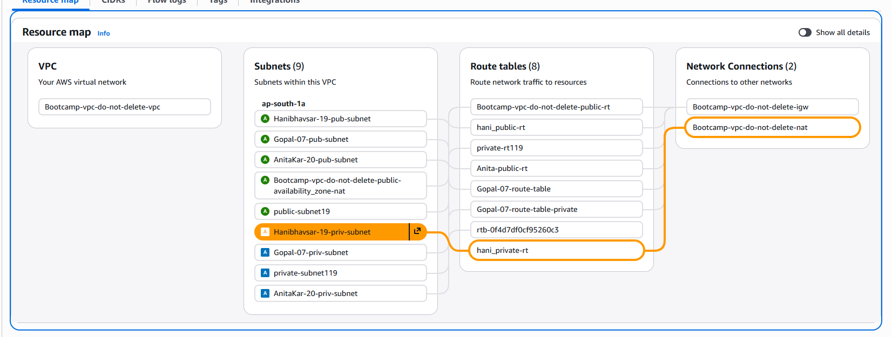
