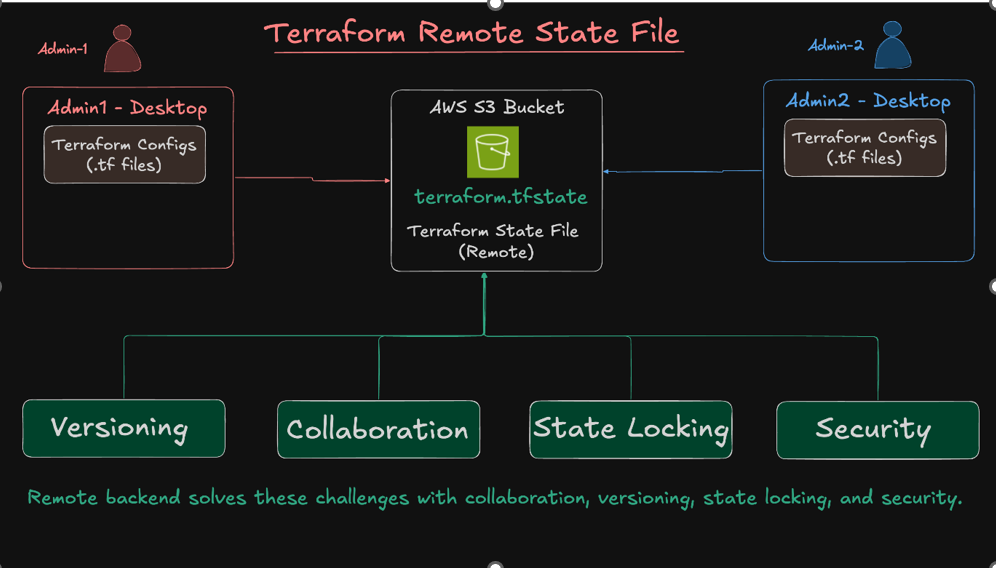
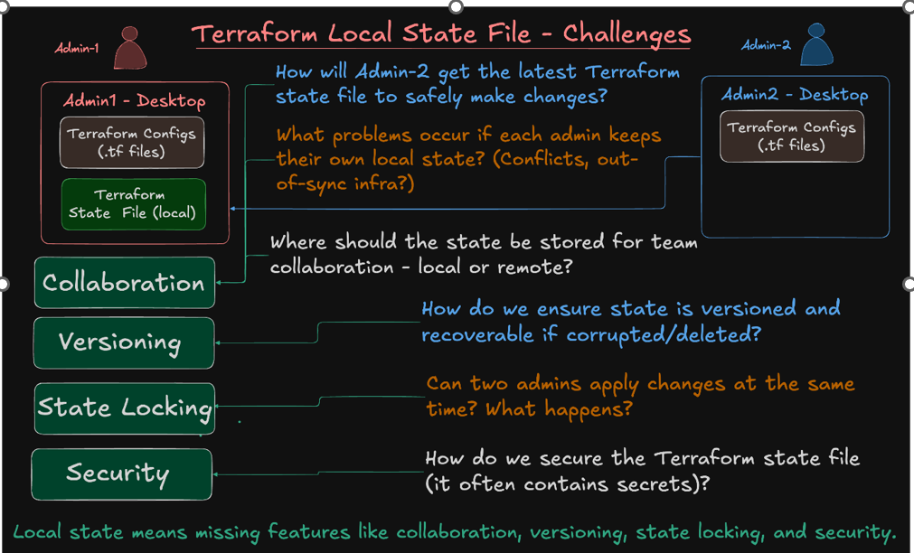
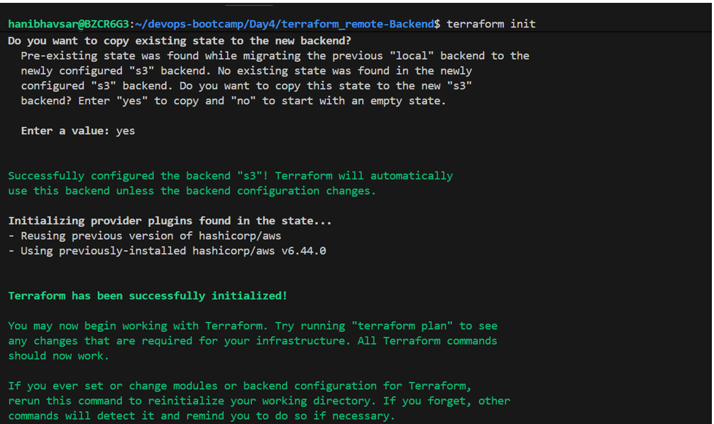
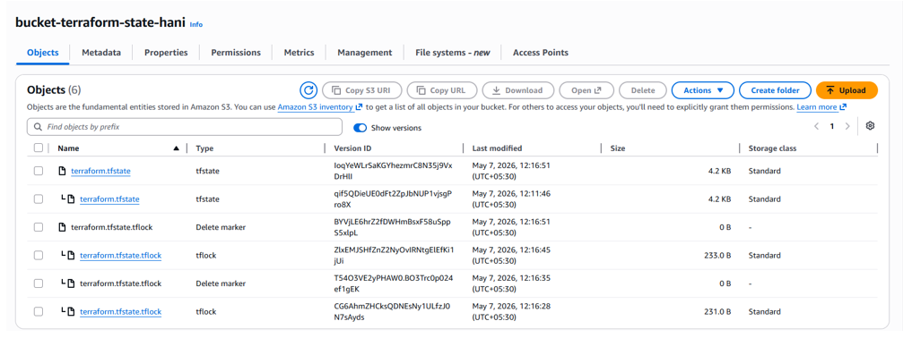
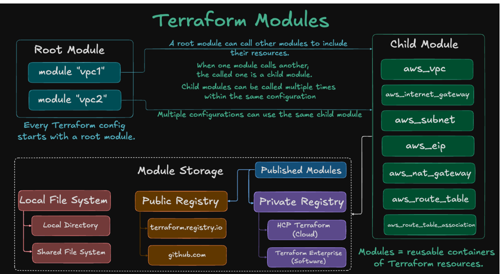

# Section 6: Terraform remote Backend setup 

for Terraform Remote Backend we have to use below block in terraform block 
backend "s3" {
    bucket         = "tfstate-dev-us-east-1-jpjtof" # <-- Replace with your actual bucket name
    key            = "vpc/dev/terraform.tfstate"   # use you path 
    region         = "us-east-1"
    encrypt        = true
    use_lockfile = true  # used for State locking 
  }  

# Terraform Module:
We can Write Once and use it anywhere

 
