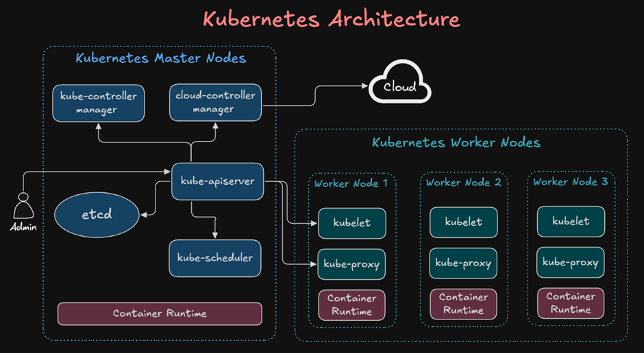
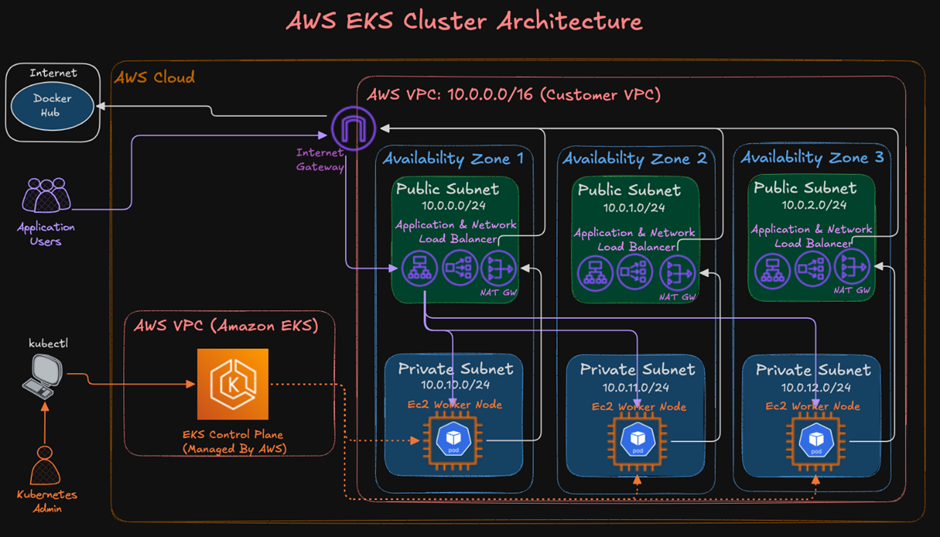
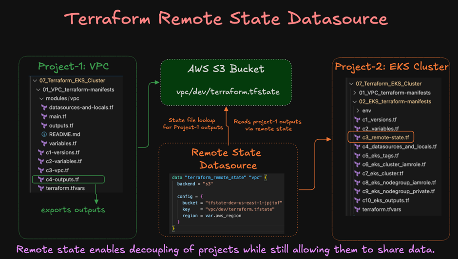
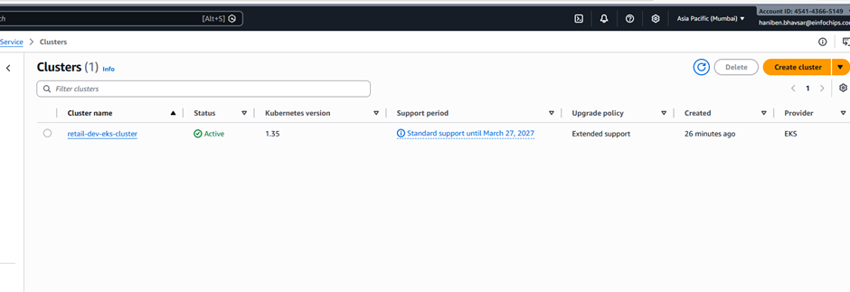
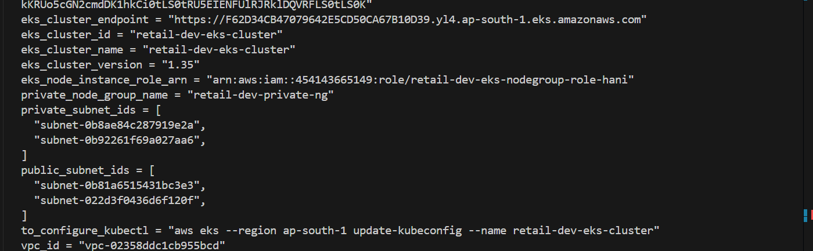

Day 5 : 
Why Kubernetes? Why not Docker?

Create EKS Cluster using Terraform:

 
# What is Kubernetes?
Kubernetes is a container orchestration platform used to deploy, manage, scale, and monitor containers automatically.
Think of it like:
Docker runs containers.
Kubernetes manages many containers across many servers.
# Kubernetes Architecture
Kubernetes mainly has 2 parts:
1. Master Node (Control Plane)- the “brain”
2. Worker Node → runs applications/containers
# 1. Master Node (Control Plane)
The master node controls the whole cluster.
## a) etcd
etcd is the database of Kubernetes.
* Stores all cluster information
* Keeps records of:

  * nodes
  * pods
  * configurations
  * secrets
## b) kube-apiserver
kube-apiserver is the main entry point of Kubernetes.
* Every request goes through API Server
* It receives commands from:
  * users
  * kubectl
  * dashboards
  * CI/CD tools
## c) kube-scheduler
kube-scheduler decides:
> “Which worker node should run the pod?”
It checks:
* CPU
* memory
* resources
* node health
## d) kube-controller-manager
kube-controller-manager manages cluster state.
It continuously checks:
* Are all nodes healthy?
* Are pods running correctly?
* Is the desired number of pods available?

If something fails, it tries to fix it automatically.

# 2. Worker Node

Worker nodes actually run the applications/containers.

They follow instructions from the master node.
## a) kubelet
kubelet is an agent running on each worker node.
Responsibilities:
* Talks to master node
* Ensures containers are running
* Monitors pods
## b) kube-proxy
kube-proxy handles networking
Responsibilities:
* Routes traffic
* Load balancing
* Connects services to pods
## c) Container Runtime
Container runtime actually runs containers.

EKS  Architecture :
 

# Remote State Data Source 
 

# Cluster

 

 
 
 

 
