# Kubernetes Pods: 
Pods are the smallest deployable units of computing that you can create and manage in Kubernetes.
Pods in a Kubernetes cluster are used in two main ways:
•	Pods that run a single container. The "one-container-per-Pod" model is the most common Kubernetes use case; in this case, you can think of a Pod as a wrapper around a single container; Kubernetes manages Pods rather than managing the containers directly.
•	Pods that run multiple containers that need to work together. A Pod can encapsulate an application composed of multiple co-located containers that are tightly coupled and need to share resources. These co-located containers form a single cohesive unit.

# What is Kubernetes api ?
The Kubernetes API (or K8s API) is the main interface used to communicate with a Kubernetes cluster.
Any request sent to Kubernetes goes through the kube-apiserver, and those requests are called Kubernetes API requests.

## what is init container ?
An Init Container in Kubernetes is a special container that runs before the main application container starts.

## Sidecar continer 
A Sidecar Container is a secondary container that runs alongside the main application container inside the same Pod.

## Differnce 
init containers do not support lifecycle, livenessProbe, readinessProbe, or startupProbe whereas sidecar containers support all these probes to control their lifecycle.

## Deploy the pod : 

```bash
kubectl apply -f 01_catalog_pod.yaml(yml.file name)
```
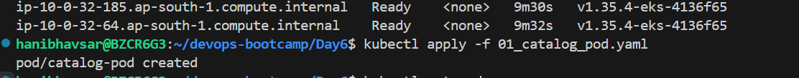

## To check pods Status  (List Pods) 
```bash
kubectl get pods
```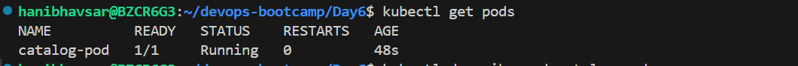

## To Descibe Pods ( it will Show all information about pod)
```bash
kubectl describe pod catalog-pod
```
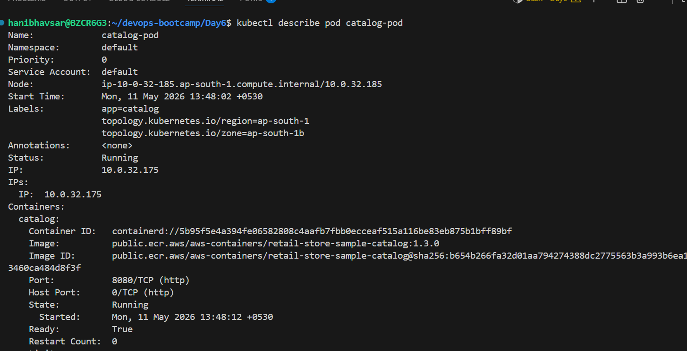

 ## To view Loges 
```bash
kubectl logs -f catalog-pod
```
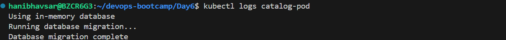

## Port Fordwarding 
kubectl  port-forward pod/catalog-pod 7080:8080
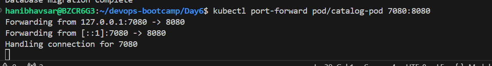

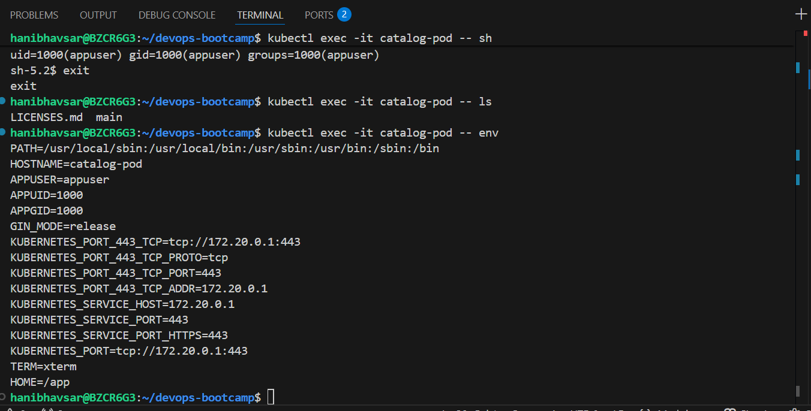

## Delete Pods
```bash
kubectl delete pod <pod-name>
```
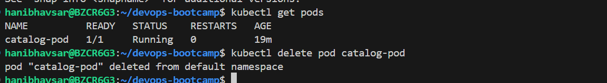

## Depolyment 
A Deployment manages a set of Pods to run an application workload, usually one that doesn't maintain state.
Run this application, keep N copies running, and recover automatically if something fails.


## Probes Explained

| Probe Type          | Purpose                                   | Example Path | Behavior                                                       |
| ------------------- | ----------------------------------------- | ------------ | -------------------------------------------------------------- |
| **Readiness Probe** | Checks if Pod is *ready* to serve traffic | `/health`    | If it fails, Pod is temporarily removed from Service endpoints |
| **Liveness Probe**  | Checks if container is *alive*            | `/health`    | If it fails repeatedly, kubelet restarts the container         |

##  Deploy 
```bash
kubectl apply -f 01_catalog_deployment.yaml
```
##  Verify Deployment, ReplicaSet, and Pod
```bash
kubectl get deployment
kubectl get replicaset
kubectl get pods -o wide
```
Check rollout status:

```bash
kubectl rollout status deployment/catalog
```
Describe the Pod to view probes and security context:
```bash
kubectl describe pod <pod-name>
```
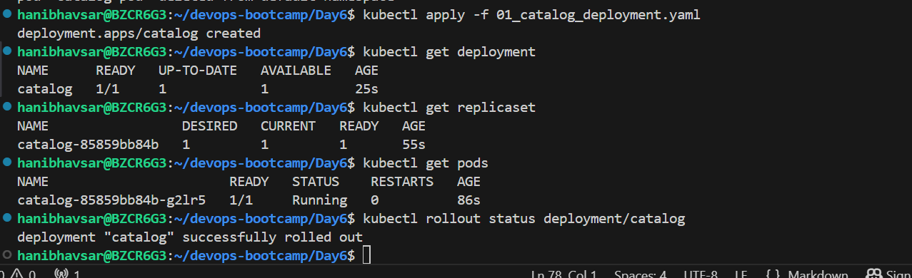

## Access the Application via Port Forwarding
```
# Expose the Pod locally using:
kubectl port-forward deploy/catalog 7080:8080
```


## Scaling

### Scale Up (1 → 3 replicas)

```bash
kubectl scale deployment catalog --replicas=3
```
You should now see **3 running Pods**.

### Scale Down (3 → 1 replica)

```bash
kubectl scale deployment catalog --replicas=1
```

Check again:

```bash
kubectl get pods
```
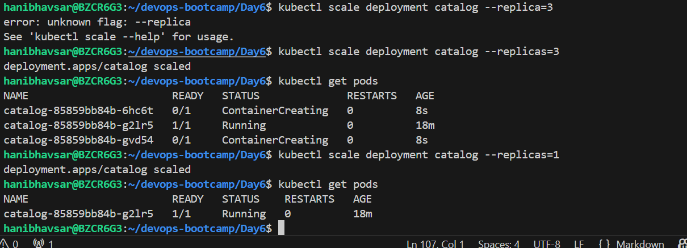

It will shows Ip address of pods
```bash
kubectl get pods -o wide 
```
##  Rolling Update (Upgrade )

### Scale Up (1 → 3 replicas)
```bash
kubectl scale deployment catalog --replicas=3
```
### Update the Deployment image
```bash
# List Deployment Revisions
kubectl rollout history deployment/catalog
# Update the Deployment
kubectl set image deployment/catalog catalog=public.ecr.aws/aws-containers/retail-store-sample-catalog:1.3.0
# List Deployment Revisions
kubectl rollout history deployment/catalog
```
Verify rollout status:
```bash
kubectl rollout status deployment/catalog
```
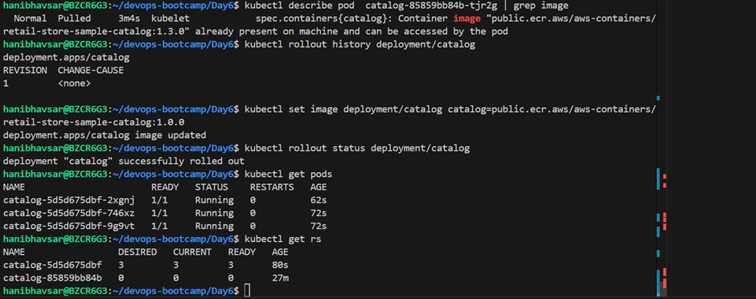

Confirm new version:
```bash
kubectl get pods -o wide
kubectl describe pod <pod-name> | grep Image
```
---

## Step-06: Rollback to Previous Version (1.0.0)

```bash
# Rollback to previous version
kubectl rollout undo deployment/catalog

# List Deployment Revisions
kubectl rollout history deployment/catalog
```
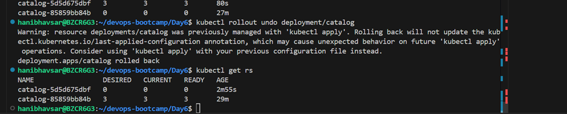

---

## Step-07: Cleanup

```bash
kubectl delete deployment catalog
```
---
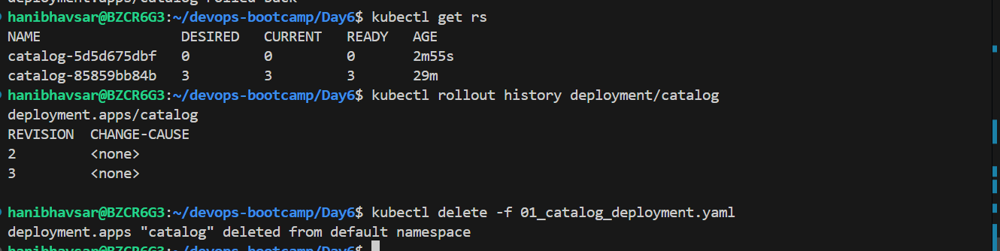

## service
In Kubernetes, a Service is an object that provides a stable network endpoint to access Pods.

### ClusterIP 
 the default type of Kubernetes Service.
It exposes your application only inside the Kubernetes cluster.

### **create Service **

```bash
kubectl apply -f 02_catalog_clusterip_service.yaml
kubectl get svc
kubectl describe svc catalog-service
```
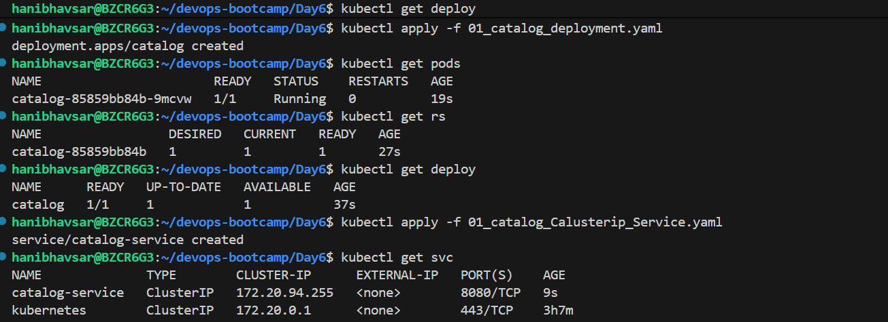

### ** Inspect EndpointSlices and Pod Matching**

After creating the service, verify how Kubernetes automatically links **Pods to the Service** using **labels**.

```bash
kubectl get pods -o wide
kubectl get endpointslices -l kubernetes.io/service-name=catalog-service
```

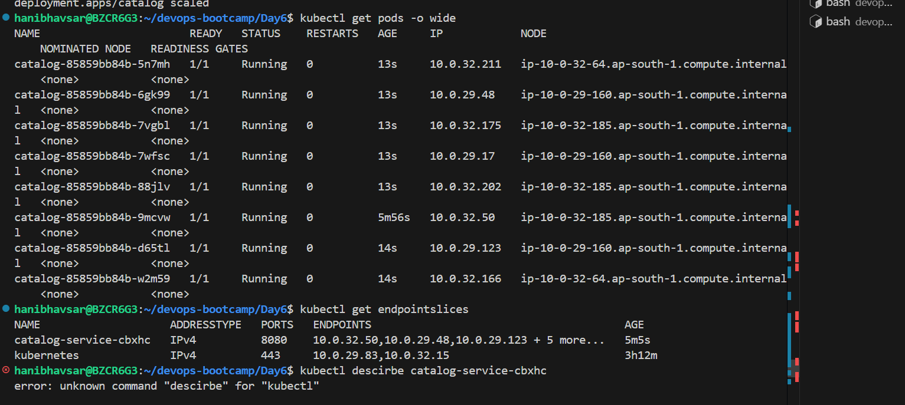

- ✅ **Key concept:**
Kubernetes **uses the selector labels** in the Service definition to automatically discover Pods that match those labels.
It then creates an **EndpointSlice** object listing the **Pod IPs** and **ports** that belong to that Service.

> Even if pods restart and get new IPs, the EndpointSlice automatically updates ensuring the Service always routes traffic to healthy, matching pods.

---

### ** Verify Service Connectivity (Internal Test)**

Run a test pod inside the same namespace:

```bash
kubectl run test --image=curlimages/curl -it --rm -- sh
```

Inside the pod:

```bash
curl http://catalog-service:8080/topology
```
---
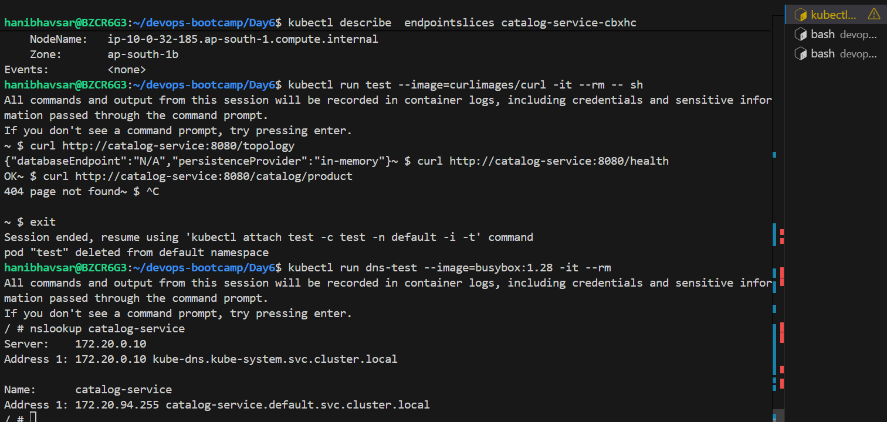

### ** DNS Resolution Check**
```bash
kubectl run dns-test --image=busybox:1.28 -it --rm
```

Inside pod:

```bash
nslookup catalog-service
```
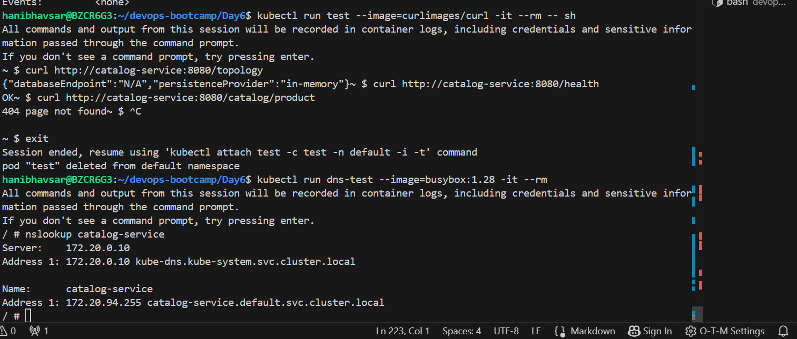

---

##  Clean Up 
```bash
# Delete k8s Resources
kubectl delete svc catalog-service
kubectl delete deploy catalog

### OR ###

# Delete using YAML files
kubectl delete -f catalog_k8s_manifests
```
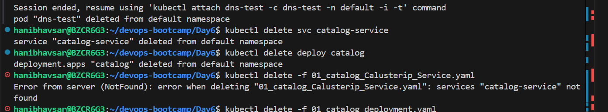

#  Kubernetes ConfigMap 
A ConfigMap in Kubernetes is used to store configuration data separately from your application code.

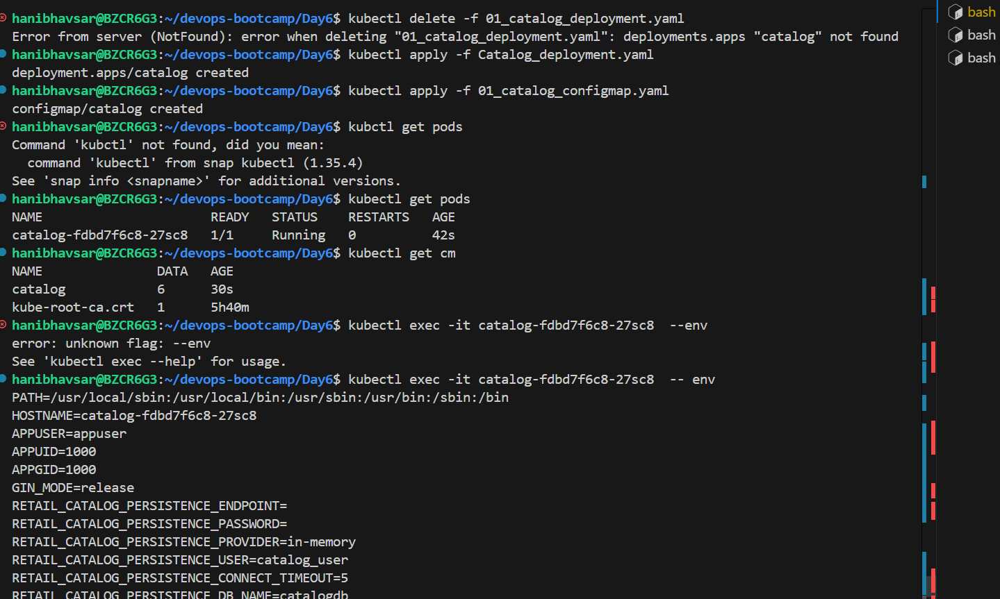
