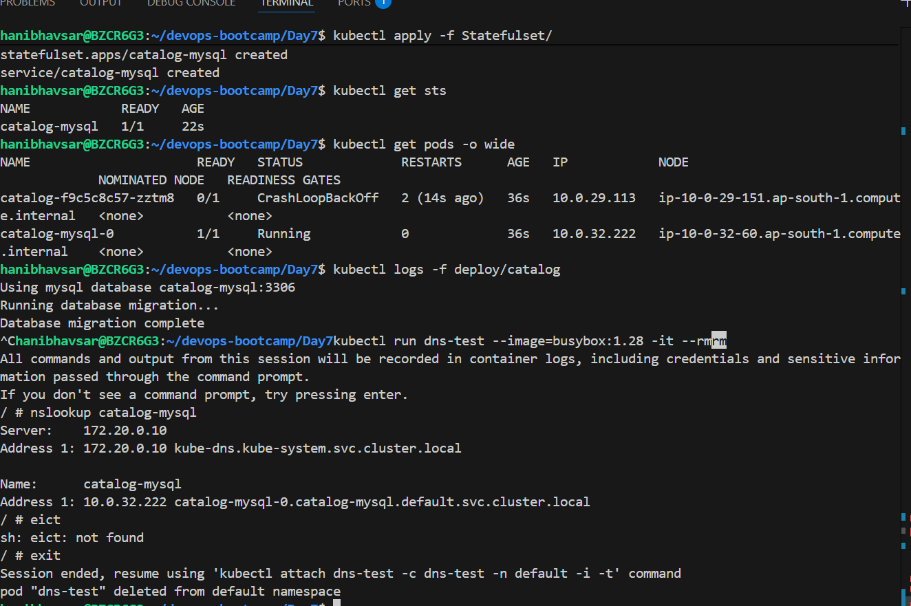
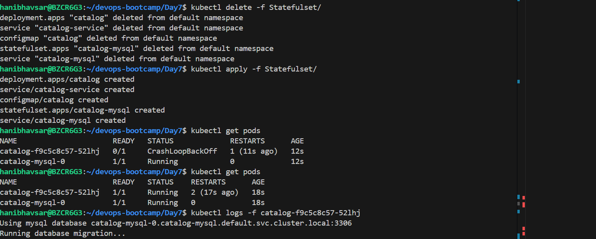
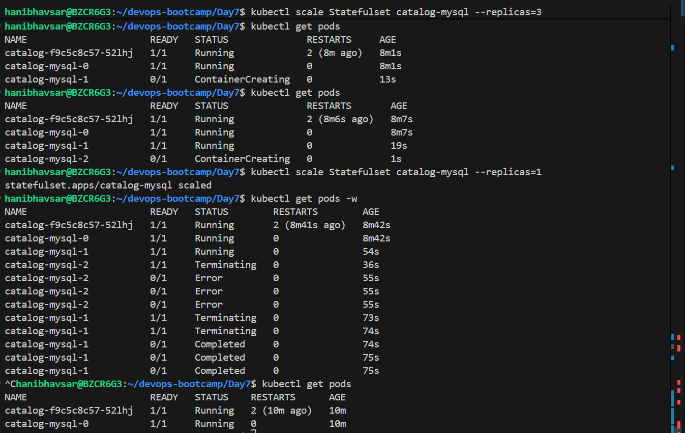
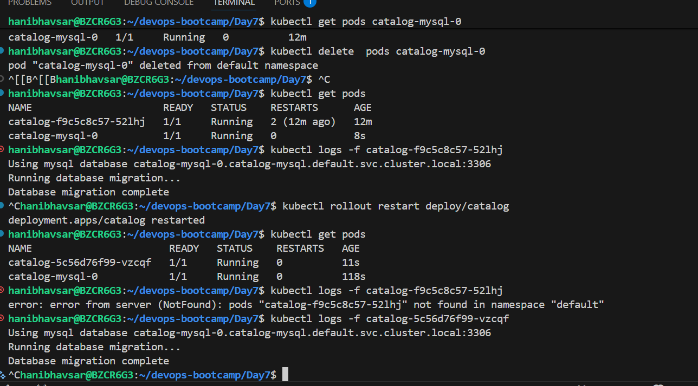
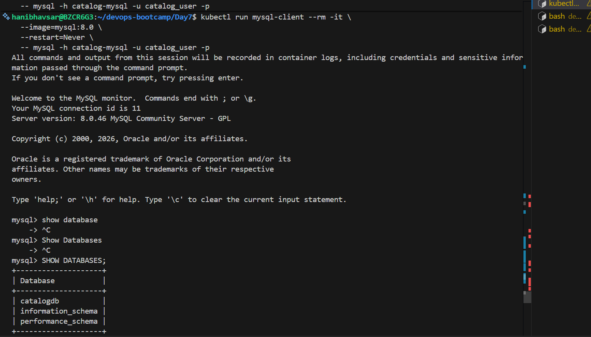
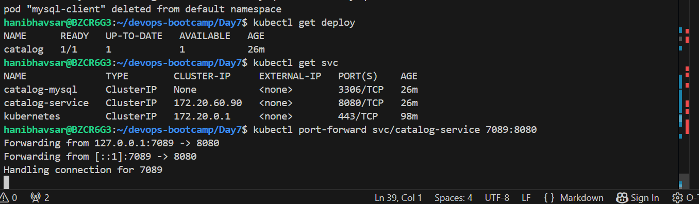
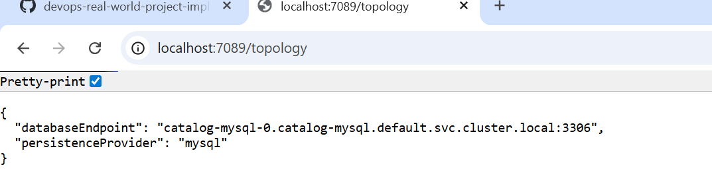

# Kubernetes statefulset 
A StatefulSet runs a group of Pods, and maintains a sticky identity for each of those Pods. This is useful for managing applications that need persistent storage or a stable, unique network identity.

# Statefulset vs Deployment 
 **Deployment**: Best for stateless applications (e.g., web servers) where Pods can be replaced randomly.**StatefulSet**: Required for stateful applications (e.g., MySQL, PostgreSQL, ZooKeeper, Elasticsearch) where each instance maintains unique data.
 

 # Headless service 
 A Headless Service in Kubernetes is a Service that does not get a ClusterIP.
 A Kubernetes Service that provides direct DNS access to individual Pods instead of a single virtual IP.

 # Headless service vs Cluster Ip 
**ClusterIP** hides Pods behind one stable IP and load balances traffic.
**Headless** Service exposes individual Pods directly without load balancing.

## Apply 

# Test DNS Resolution 

# Scale up pods
kubect scale Statefulset <Statsefulset-name> --replica=3

# Sequential Order 
catalog-mysql-0 → catalog-mysql-1 → catalog-mysql-2
deltion order :
catalog-mysql-2 → catalog-mysql-1 → catalog-mysql-0

Scaling MySQL StatefulSet to multiple replicas only creates independent MySQL servers. Kubernetes does not configure replication automatically.

# Accessing Mysql Datbase 

# port-forwarding 

