# Kubernetes Secrets 
A Secret is an object that contains a small amount of sensitive data such as a password, a token, or a key.

You can use Secrets for purposes such as the following:
•	Set environment variables for a container.
•	Provide credentials such as SSH keys or passwords to Pods.
•	Allow the kubelet to pull container images from private registries.

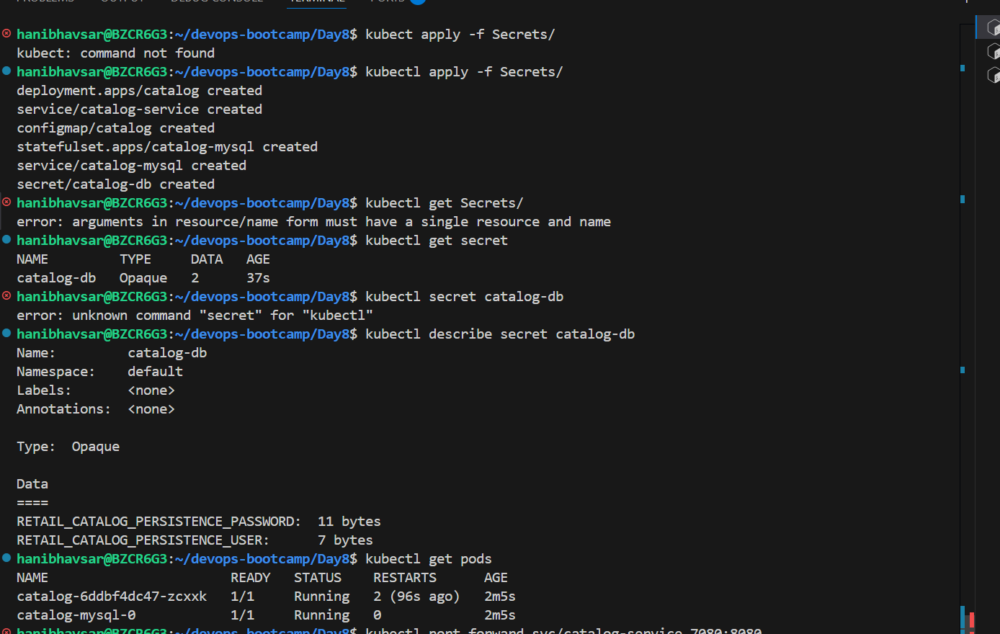

# Kubernetes Demon Set:
A DaemonSet defines Pods that provide node-local facilities. These might be fundamental to the operation of your cluster, such as a networking helper tool, or be part of an add-on.

# Pod Indentity Agent 

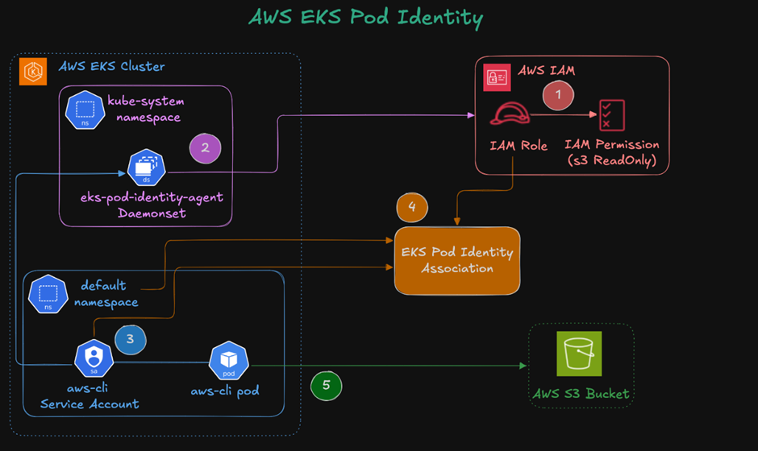

# Sevice Account : 
A service account is a type of non-human account that, in Kubernetes, provides a distinct identity in a Kubernetes cluster.

1.Install EKS Pod Identity Agent

2. Deploy Aws Cli Pod and check list S3 bucket 

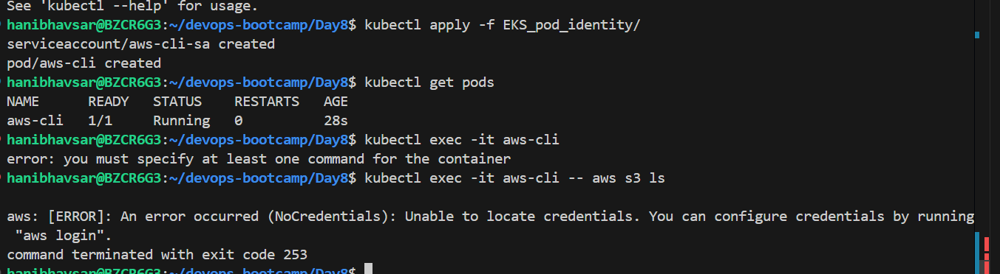

3.create Iam  role for pod identity and crete pod idntity Association

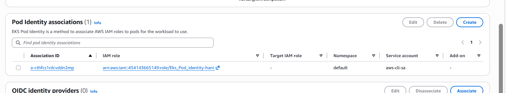

4. restart pod and chcek S3 list 

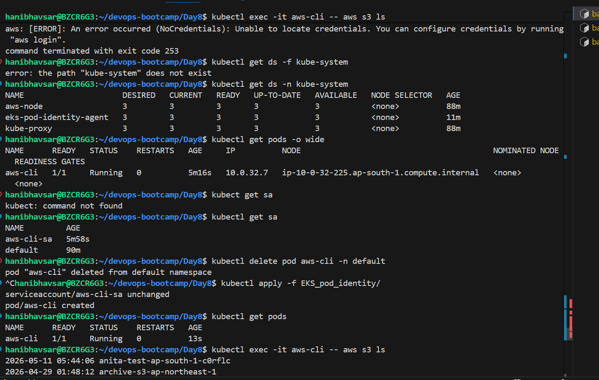

# Aws Secret Manager for Eks WorkLods

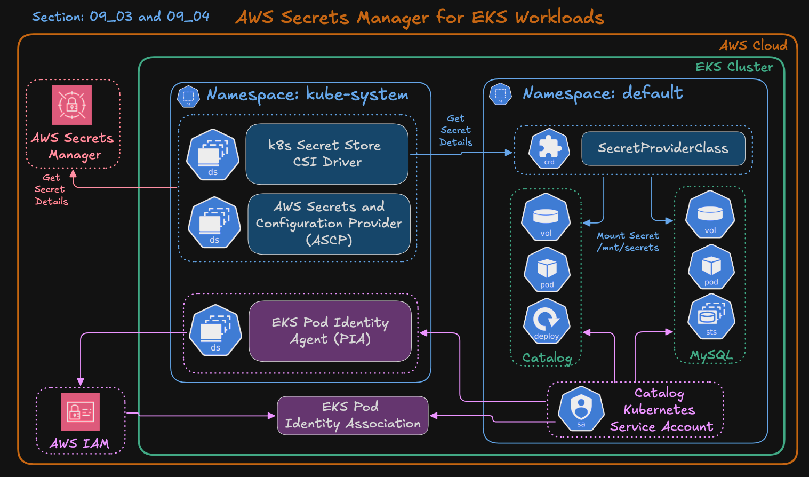

## Helm 
Helm is the package manager for Kubernete 

## Benifit of Helm

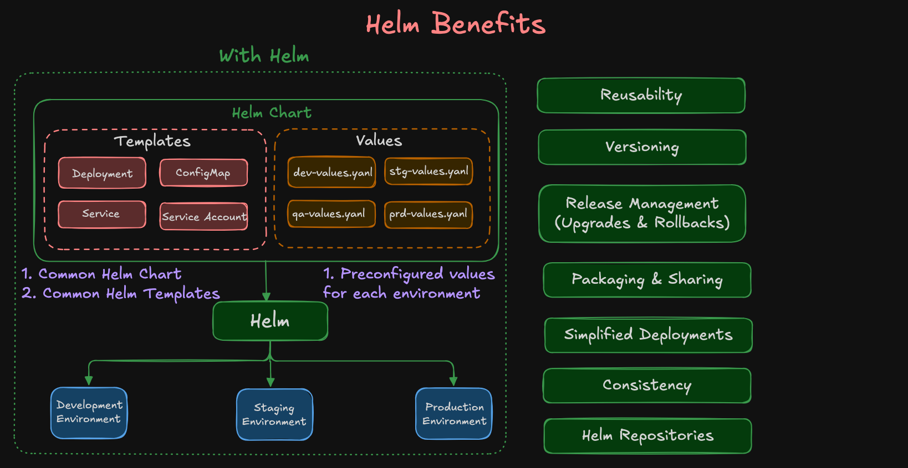

## install Helm and add helm repositories

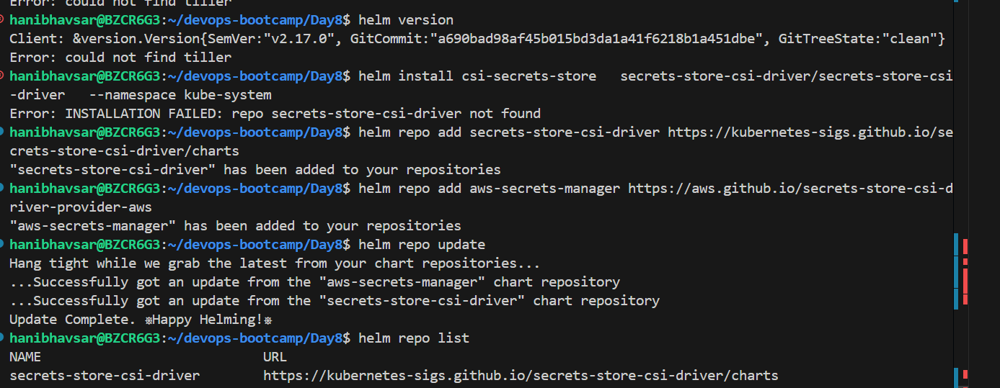

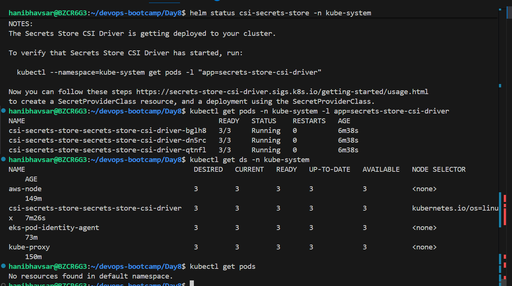

## Verify Installtion

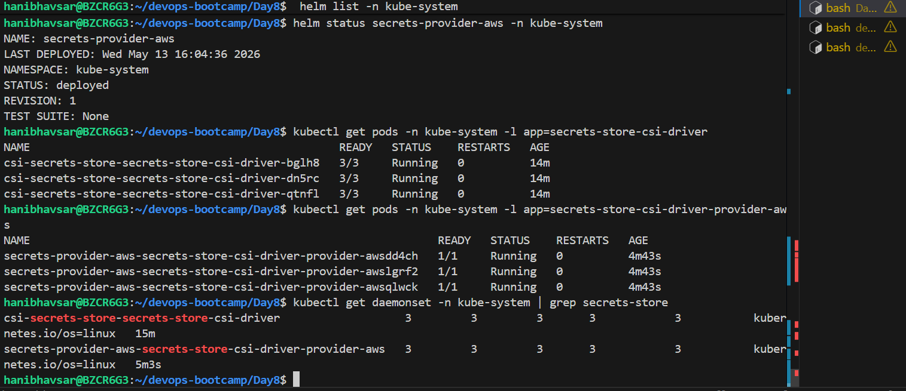

## create Iam Role , Policy and scecrete 
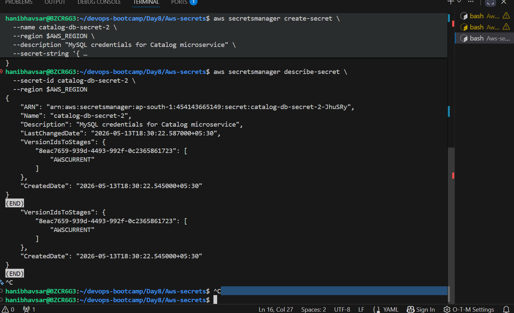

## create 
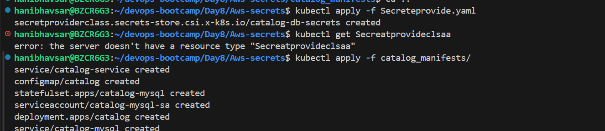
