# AWS EBS CSI Driver Architecture 

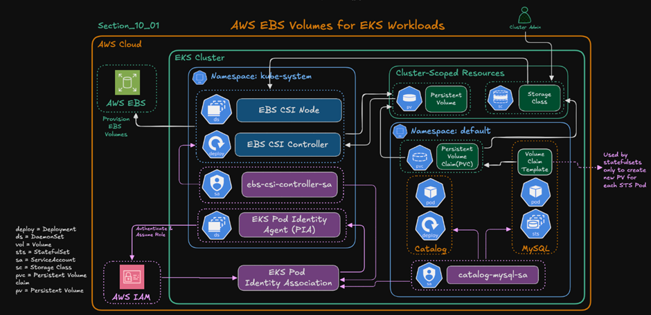

## Persistent Volume : (PV) 
A PersistentVolume (PV) is a piece of storage in the cluster that has been provisioned by an administrator or dynamically provisioned using Storage Classes.
## Persisent Volume Claim :(PVC)
A PersistentVolumeClaim (PVC) is a request for storage by a user. It is similar to a Pod. Pods consume node resources and PVCs consume PV resources

## Storage Class : (SC):
A StorageClass defines:
•	what type of storage to create 
•	how to create it 
•	performance type 
•	reclaim policy 
•	provisioner 
It enables dynamic provisioning.

## flow for EBS csi driver 
Application Pod
      ↓
PVC (PersistentVolumeClaim)
      ↓
StorageClass
      ↓
EBS CSI Controller
      ↓
AWS EBS Volume Created
      ↓
PersistentVolume (PV)
      ↓
Volume Attached to EC2 Worker Node
      ↓
EBS CSI Node Plugin
      ↓
Mount inside Pod

## Create Pod identity and install CSI driver 

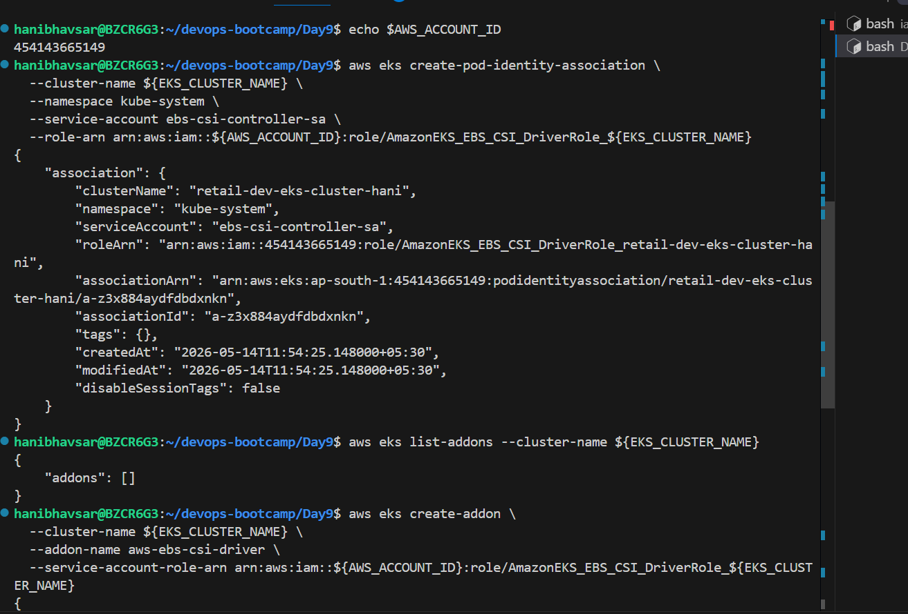

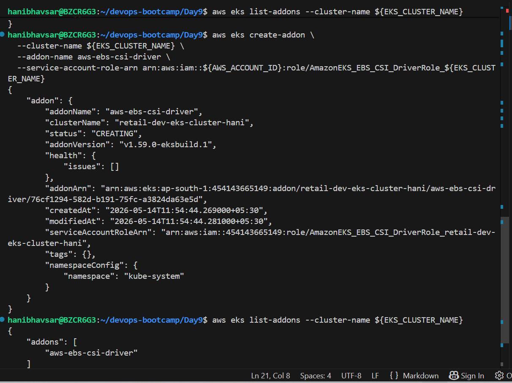

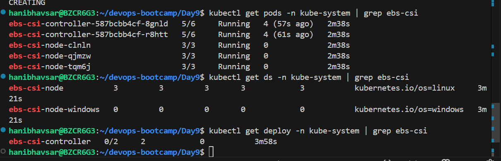

## deploy and verify resource 

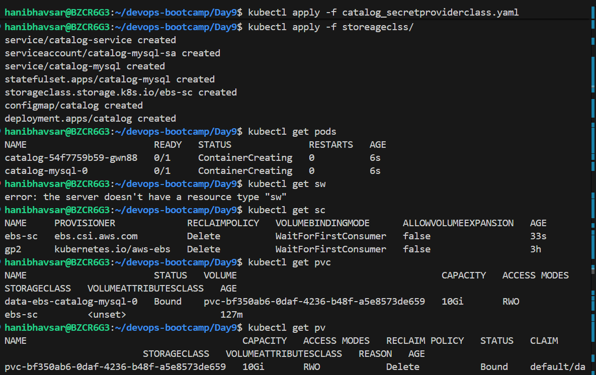

## Test contivity 

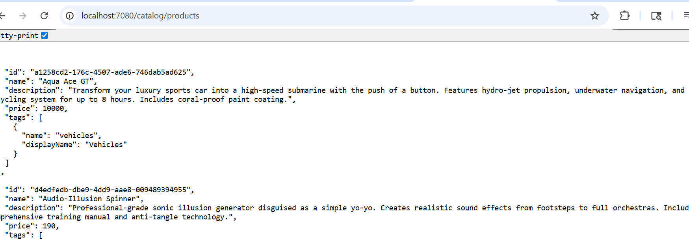

## If we delete pod Data wil persistant 

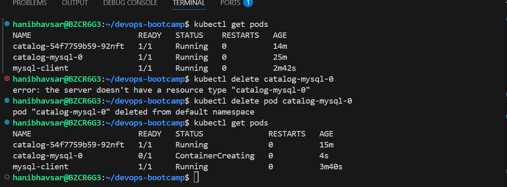

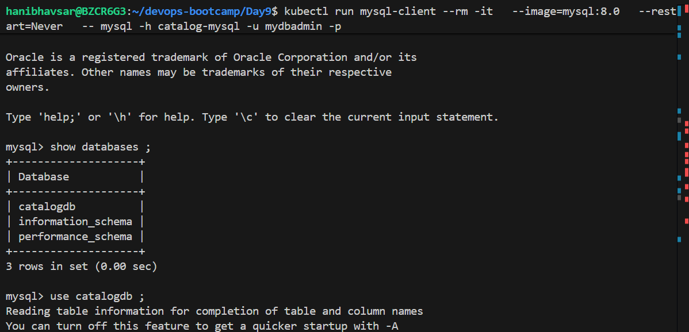

evenn if we delete pod pvc will be thier 

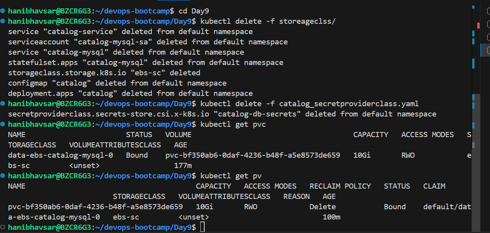

## ExternalName Service
In Kubernetes, an ExternalName Service is a special type of Service that does not create a real backend or load balancer.
Instead, it simply acts as a DNS alias (CNAME record).

## Eks + RDS mysql DB 

1. create Scueity group for Database 
get EKS cluster security group :
aws eks describe-cluster \
  --name  retail-dev-eks-cluster-hani \
  --query "cluster.resourcesVpcConfig.clusterSecurityGroupId" \
  --output text

2. Connect using RDS endpoint and create database 
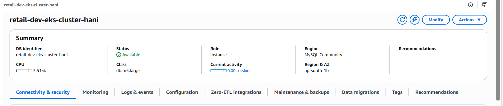
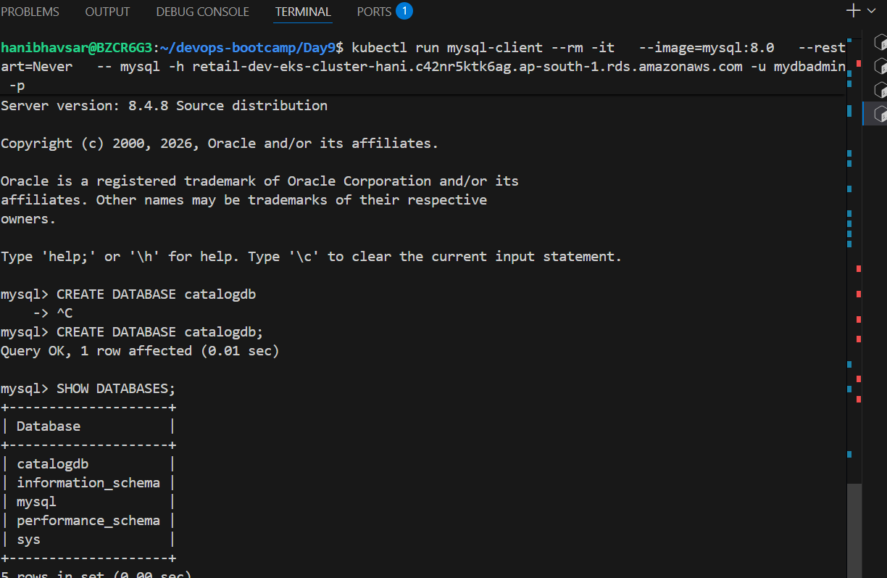

3. we have to create one more manifests file which is called externalname service for RDS contivity.

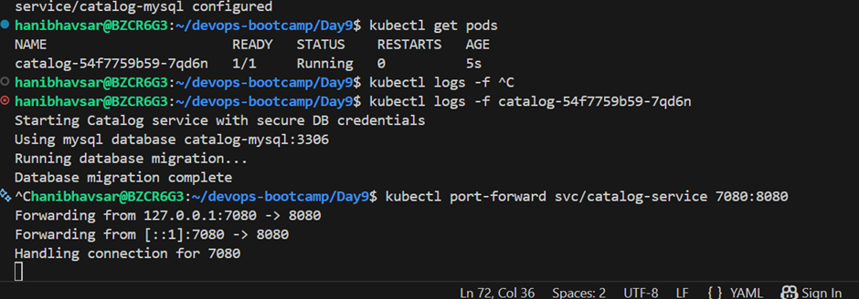

 we can able to get data using RDS 
 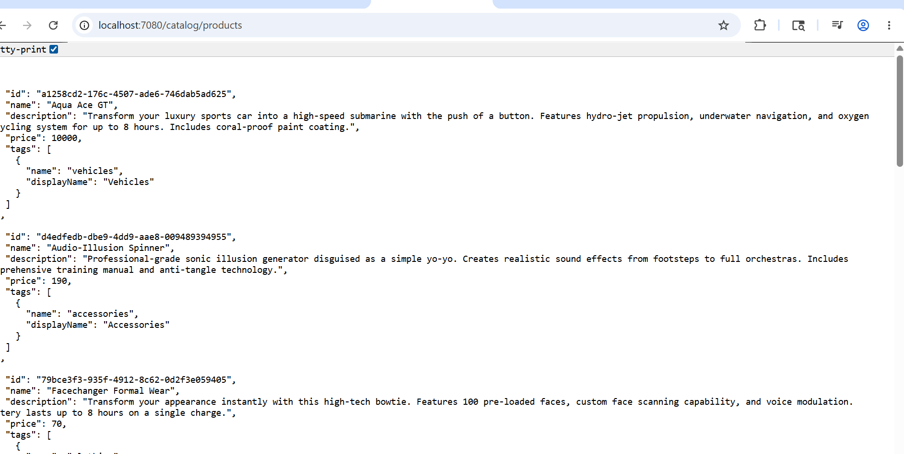

## Verify database entries in RDS 

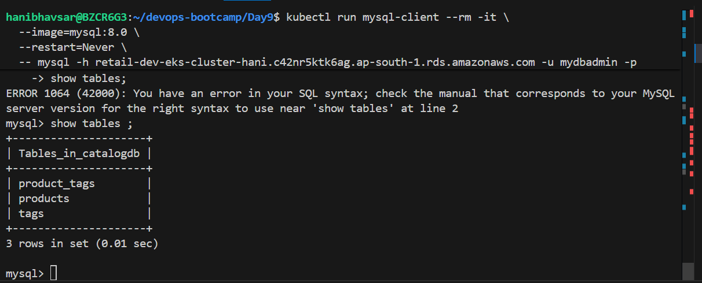

